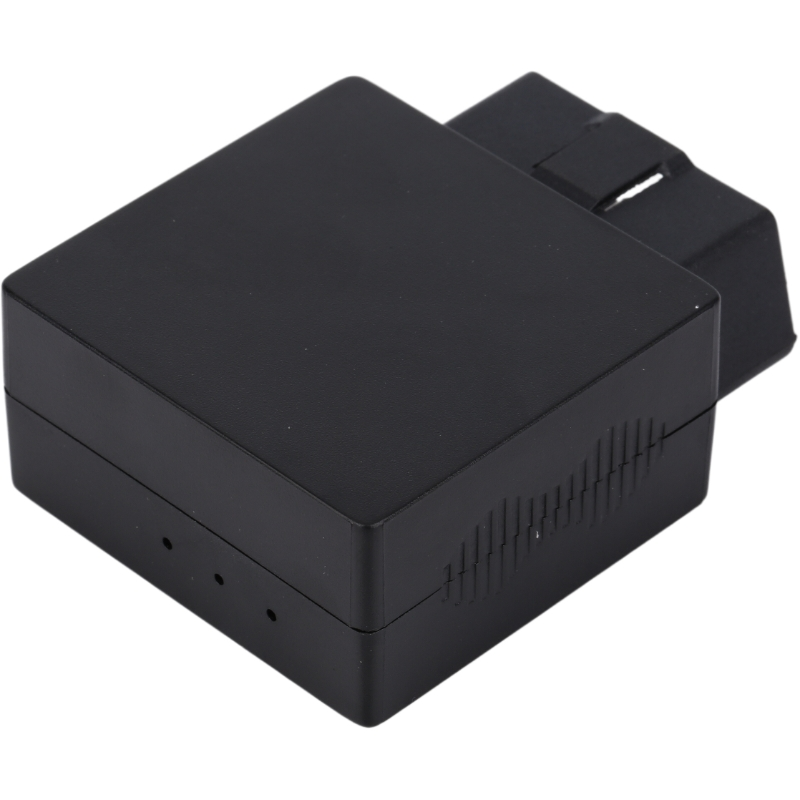

# CanTrack - G183

The CanTrack G183 is a JOBD series OBD level GPS tracker designed for vehicle diagnostics and real time telematics. Built for use in passenger cars and commercial vehicles, the G183 combines compact in vehicle connectivity with GNSS positioning and continuous reporting so operators can collect location, mileage, fuel metrics, diagnostic trouble codes and alarm events.

As a Plaspy compatible device, the G183 can feed location, diagnostic and event streams into Plaspy for unified visualization, alerting and reporting. Its support for OBD level diagnostic protocols and TCP or SMS reporting makes integration into Plaspy straightforward for fleet operators, service providers and integrators seeking combined tracking and vehicle health data.

## Key Highlights

- Plaspy compatible OBD level GPS tracker engineered for vehicle diagnostics and fleet telematics.
- Multi constellation GNSS positioning with a 56 channel receiver and approximately 2.5 m CEP accuracy.
- Broad diagnostic protocol support for extensive vehicle coverage and DTC reporting.
- Real time reporting over TCP and SMS for location, mileage, fuel monitoring and telemetry upload.
- Comprehensive alarm set including speeding, harsh driving, collision, towing, SOS and plug unplug alerts.
- Built in ±16 g 3 axis accelerometer and 8 MB flash buffering for event reconstruction and offline storage.
- Compact durable form factor designed for scalable fleet deployments and anti theft monitoring.

## How It Works with Plaspy

When connected, the G183 transmits location, diagnostic trouble codes and event data over TCP or SMS so Plaspy can ingest and present those feeds in dashboards, maps and reports. This enables centralized monitoring of vehicle position, status and alarms alongside other fleet assets managed in Plaspy.

- Real time location and telemetry updates delivered via TCP and SMS for Plaspy ingestion and visualization.
- Diagnostic Trouble Code upload and protocol aware vehicle parameters to support maintenance workflows in Plaspy.
- Mileage and fuel monitoring to feed consumption analysis and operational reporting.
- Wide alarm set including SOS, collision, towing and plug unplug to trigger Plaspy alerts and response workflows.
- Local event buffering and accelerometer data to support accurate incident history during temporary connectivity loss.

## Typical Use Cases

- Fleet management combining live tracking with mileage and fuel monitoring for route optimization.
- Vehicle diagnostics and preventive maintenance programs that prioritize repairs using uploaded DTCs.
- Anti theft and rapid response setups using towing, plug unplug and SOS alerts integrated into Plaspy.
- Driver behavior monitoring and coaching using harsh driving and collision event data for scorecards.
- Mixed fleets and commercial vehicle telemetry where broad protocol support improves device coverage.

## Why Choose This Tracker with Plaspy

The G183 offers a practical balance of diagnostic depth and continuous tracking that fits well with Plaspy workflows. Its OBD level diagnostics and multi constellation GNSS positioning provide the kinds of telemetry and location data fleet operators rely on for maintenance planning, safety monitoring and operational oversight. Built in accelerometer data and onboard buffering help preserve event fidelity and assist in reconstructing incidents for analysis.

If you want to learn more about how the G183 works with Plaspy and whether it fits your fleet requirements, visit Plaspy to explore platform features and integration options https://www.plaspy.com. Product specifications, availability and manufacturer details can change over time, so please verify current technical information and compatibility on the official CanTrack website https://www.cantrackgps.com/.
