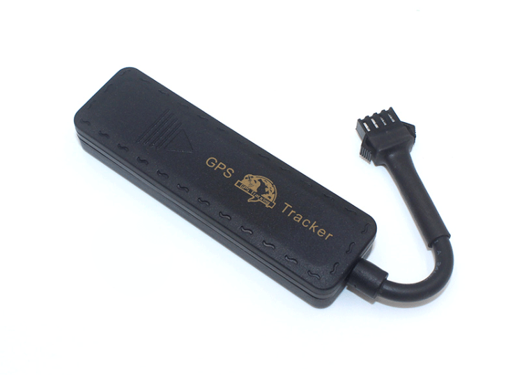

# CanTrack - G900

The CanTrack G900 is a compact GPS tracker designed for monitoring vehicles and valuable equipment. It provides real time tracking to follow location continuously and includes safety and security features such as an overspeed alarm and a power cut alarm. Built with an IP65 rated shell, the G900 is intended for use in environments where dust and water splashes are a concern, making it suitable for a range of outdoor and industrial applications.

As a device compatible with Plaspy, the G900 can be integrated into fleet and asset management workflows to provide visibility and operational insight. Plaspy can ingest the G900 location and alarm information to present live positions, generate alerts for overspeed or power loss, and include the device in reporting and monitoring dashboards used by fleet managers and operations teams.

## Key Highlights

- Real time location tracking for continuous visibility of vehicles and assets
- Overspeed alarm to notify managers when a predefined speed threshold is exceeded
- Power cut alarm that signals when the device power is disconnected
- IP65 rated housing for protection against dust ingress and water splashes
- Supported network and GNSS technology for standard positioning and communications
- Manufacturer stated accuracy around 5 meters for typical location reporting

## How It Works with Plaspy

When used with Plaspy, the CanTrack G900 provides location and event data that Plaspy displays in fleet dashboards and reporting tools. Plaspy can surface the G900 alarms and movement data to help operations teams monitor assets and respond to incidents.

- Live position display and map visualization for individual devices and whole fleets
- Alarm handling for overspeed and power cut events with configurable notifications
- Historical route playback and simple trip reports for review and compliance
- Fleet level status and summary reporting to track vehicle or asset activity
- Grouping and tagging of devices for operational organization and monitoring

## Typical Use Cases

- Fleet vehicle tracking for small to medium commercial fleets
- Monitoring construction or rental equipment at outdoor sites
- Security oversight for high value mobile assets
- Driver behavior awareness through overspeed notifications
- Operational visibility where ruggedized protection is required

## Why Choose This Tracker with Plaspy

The CanTrack G900 offers a balanced set of features that match common needs in fleet and asset monitoring: continuous location, practical alarms, and a durable enclosure for outdoor environments. Paired with Plaspy, the device's core capabilities can be turned into actionable insight through maps, alerts, and reports that support day to day fleet operations.

If you are evaluating trackers for integration into Plaspy, the G900 is a good option to consider for use cases that require basic telematics, alerting, and increased ruggedness. For more details about Plaspy and how the platform can display and manage devices like the CanTrack G900, learn more on the Plaspy website https://www.plaspy.com. Product specifications and availability can change over time, so verify the latest technical details and support information on the manufacturer site https://www.cantrackgps.com/.
