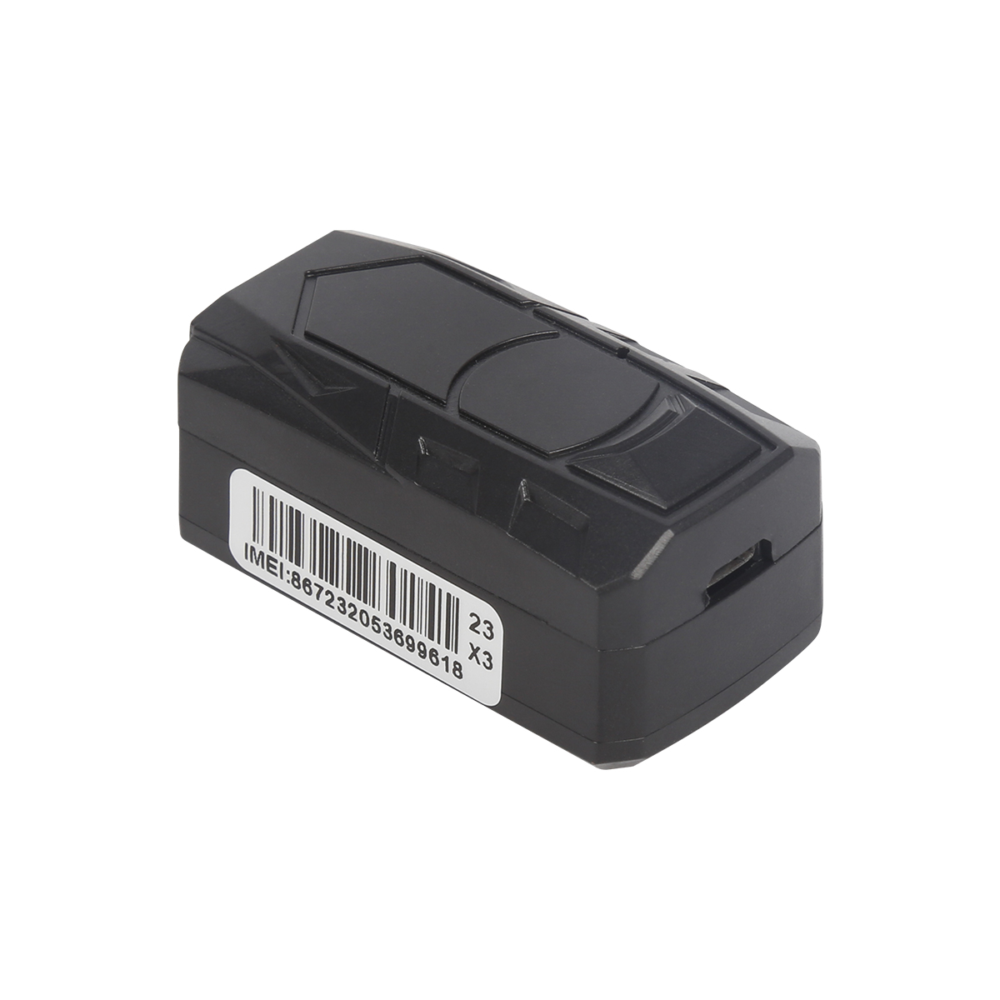

# CanTrack - GF20

The CanTrack GF20 is a mini magnet GPS tracker designed for discreet and short-term tracking purposes. With its compact size of 50mm\*27mm\*25mm, it can easily fit into a small bag or be hidden on a car. This makes it an ideal choice for personal use or for tracking assets that require temporary monitoring. 

One of the standout features of the GF20 is its optional voice remote listen function. This allows users to remotely listen to the surrounding environment, providing an added layer of security and surveillance. Whether you need to keep an eye on your personal belongings or monitor the activities of a vehicle, the GF20 offers a reliable and convenient solution.

In terms of tracking capabilities, the GF20 utilizes real GPS, LBS, and AGPS technologies to provide accurate location information. Users can track the device via SMS, platform, or mobile app, ensuring that they have multiple options for accessing the tracking data. Additionally, the GF20 supports geo-fencing, allowing users to set up virtual boundaries and receive alerts when the device enters or exits these predefined areas. It also features a low battery alarm and vibration alarm, ensuring that users are promptly notified of any potential issues or tampering.

The GF20 offers multiple working modes, allowing users to customize its behavior based on their specific needs. It also has the ability to store data in its memory when GSM signal is lost, ensuring that no tracking information is lost during temporary signal interruptions. With a standby time of 5 to 8 days, the GF20 provides reliable and continuous tracking without the need for frequent recharging.

### Key Features:

- Finger Size: 50mm\*27mm\*25 mm
- Real GPS/LBS/AGPS Tracking
- Accurate tracking via SMS/Platform/APP
- Geo-fence/Low battery alarm
- Vibration alarm
- Voice listen/Voice recording
- Multiple working mode
- Support memory storage when GSM lost
- Standby time 5~8 days

