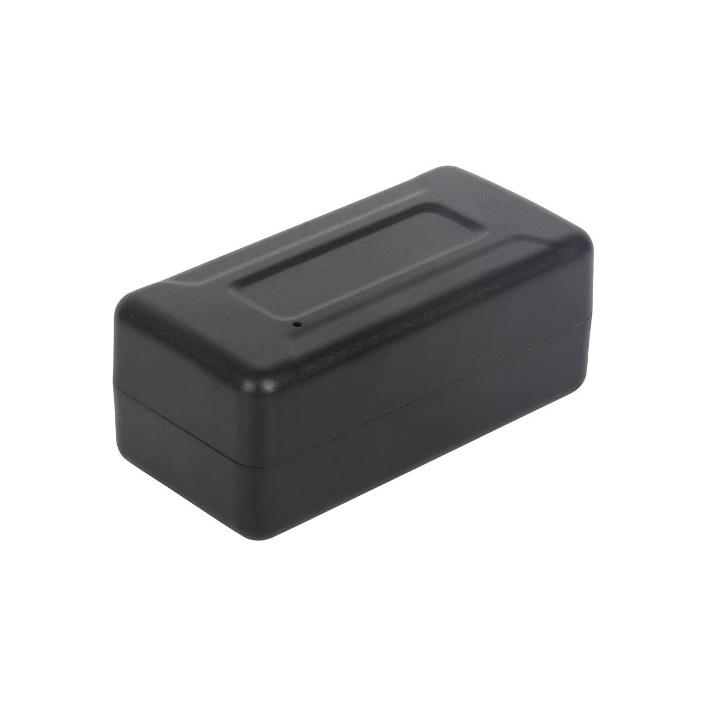

# CanTrack - GF30

The CanTrack GF30 is a compact magnet GPS tracker from the GF series designed for long duration, covert asset tracking. It features built-in magnetic mounting and a high capacity 1600mAh battery, making it suitable for discreet placement on vehicles, trailers, containers, and heavy equipment. The GF30 is optimized for real-time position reporting and basic event telemetry through platform, app, or SMS channels.

As a Plaspy compatible device out of the box, the GF30 can feed location and alarm data directly into Plaspy dashboards and workflows. That integration makes the GF30 a practical option for organizations that need continuous visibility, alerting for recovery or security incidents, and straightforward incorporation of device data into fleet monitoring and reporting routines on Plaspy.

## Key Highlights

- Plaspy compatible for seamless integration into real time tracking and fleet management workflows
- Long run battery with a 1600mAh capacity for extended remote monitoring and recovery scenarios
- Rugged magnetic housing for covert, rapid attachment to metal surfaces such as trailers and containers
- GPS plus LBS and AGPS positioning with reliable location reporting for operational visibility
- Remote voice listening and voice recording to provide additional situational awareness during incidents
- Geo fence, vibration alarm, and low battery alerts to trigger timely notifications and responses
- Local memory storage to retain data when cellular connectivity is unavailable and forward it later

## How It Works with Plaspy

When connected to Plaspy, the GF30 supplies continuous telemetry and event reporting so the platform can present live maps, alerts, and historical tracks. Position updates and alarms are delivered in real time or stored and forwarded after connectivity resumes, enabling Plaspy to maintain operational visibility and support response workflows.

- Real time location updates for continuous tracking on Plaspy maps and live views
- Geo fence and vibration alerts reported to Plaspy for perimeter monitoring and anti theft response
- Low battery and connectivity notifications to keep operations informed and reduce downtime
- Remote voice listening and recording events surfaced in Plaspy for incident assessment
- On device memory storage prevents data gaps and allows Plaspy to reconstruct historical tracks after reconnection

## Typical Use Cases

- Fleet tracking for trailers and seasonal equipment where discreet mounting and long battery life are important
- Asset recovery and anti theft monitoring using geo fence and vibration alerts to trigger response
- Container and heavy equipment oversight in remote or off road environments
- Security and incident investigation where recorded audio and location history assist recovery teams

## Why Choose This Tracker with Plaspy

The GF30 pairs endurance and discreet installation with practical reporting features that align well with Plaspy workflows. Its magnetic housing and extended battery life reduce installation effort and support longer unattended deployments, while on device storage and event reporting help maintain continuity of telemetry for operational teams.

For organizations that need straightforward hardware which can integrate into a broader telematics platform, the GF30 offers a clear balance of positioning performance and event features that Plaspy can use for dashboards, alerts, and historical analysis. The device complements Plaspy's fleet monitoring and incident response capabilities without requiring complex configuration.

Learn more about how Plaspy works with compatible devices on the Plaspy website https://www.plaspy.com. Product specifications and availability can change over time, so please verify current technical details and manufacturer guidance on the CanTrack site https://www.cantrackgps.com/.
