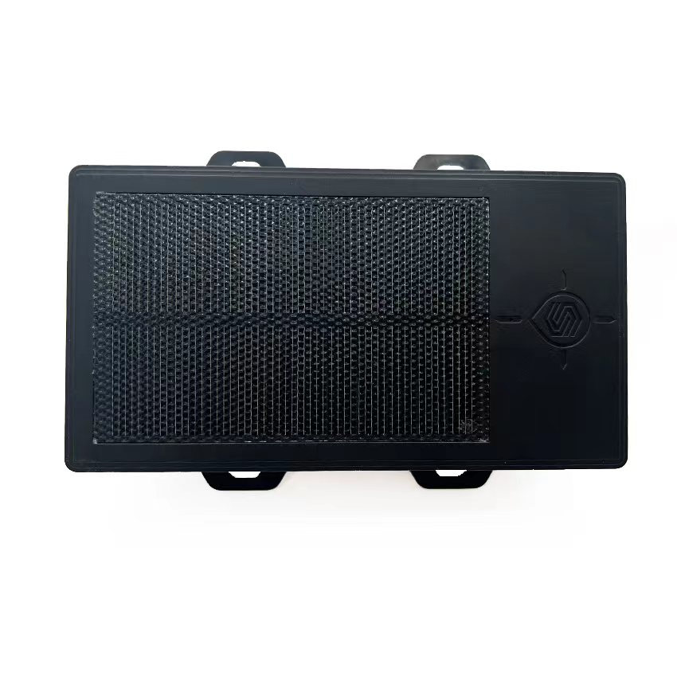

# CanTrack - GF70L-Solar

The GF70L-Solar is a solar assisted rechargeable magnetic asset GPS tracker designed for long term, low maintenance tracking of off grid assets. Built for applications such as trailers, containers, heavy equipment and other unattended items, it combines a large rechargeable battery, anti scratch solar panels and strong magnetic mounting in a compact, rugged package to extend standby time and reduce service visits.

As a Plaspy compatible device, the GF70L-Solar can feed position updates and alarm events into Plaspy for fleet oversight and anti theft workflows. Its selectable tracking modes and alarm set make it a practical choice for organizations that need persistent visibility of assets in remote or outdoor environments while minimizing the need for frequent manual intervention.

## Key Highlights

- Solar extended 12000mAh rechargeable battery for long standby and reduced maintenance cycles
- Strong magnetic tool free mounting suitable for trailers, containers and heavy machinery
- Plaspy compatible with automatic position uploads and configurable alerts for fleet and asset management
- Multiple tracking modes including real time, timed interval and movement based reporting to balance visibility and battery life
- Comprehensive alarms such as geo fence, low battery, vibration and anti removal to protect unattended assets
- Optional built in microphone for one way remote listening where permitted for recovery investigations

## How It Works with Plaspy

When connected to Plaspy, the GF70L-Solar delivers location updates and alarm events to the platform so teams can monitor assets, receive notifications and review historical activity. Plaspy uses the device reporting modes and event streams to present live positions on maps, trigger alerts and generate reports that support operational decision making.

- Real time location and status updates when active tracking is enabled for immediate visibility
- Movement based smart tracking reduces transmissions while preserving accurate traces for recovery
- Geo fence, vibration and anti removal alarms forwarded to Plaspy to trigger notifications and incident workflows
- Low battery alerts surfaced in the platform so maintenance can be scheduled before assets go offline
- Historical reporting and event logs available in Plaspy for audits, recovery and utilization analysis

## Typical Use Cases

- Fleet asset monitoring for trailers, attachments and equipment between jobs to improve utilization
- Long term unattended tracking of containers and cargo where solar recharge lowers maintenance visits
- Construction and heavy machinery security using vibration and anti removal alerts to detect unauthorized movement
- Theft recovery support through movement triggered and real time reports to aid recovery teams
- Rental fleet oversight to monitor location, usage patterns and battery health remotely

## Why Choose This Tracker with Plaspy

The GF70L-Solar pairs well with Plaspy for organizations that prioritize low maintenance asset visibility and reliable alerting. Its solar assisted battery and movement aware reporting modes help keep assets visible for extended periods without frequent onsite recharging, while Plaspy aggregates updates into maps, notifications and reports for operational teams.

Because information and product details can change over time, consult the latest manufacturer documentation to confirm model specifications and regional variants before purchase. To learn more about how Plaspy supports devices like the GF70L-Solar visit https://www.plaspy.com and verify current specifications and availability at the manufacturer site https://www.cantrackgps.com/.
