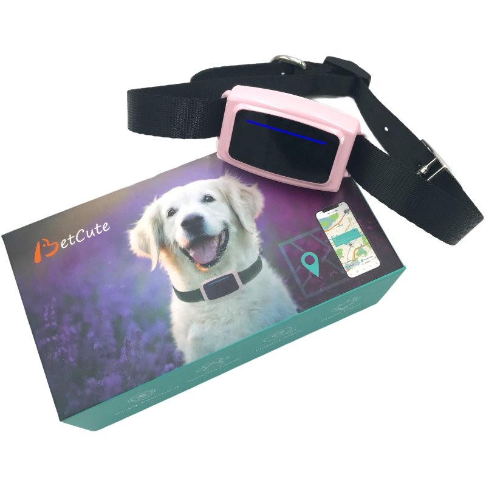

# CanTrack - NB20

The NB20 from CanTrack is a compact 4G Bluetooth smart pet tracker designed for accurate indoor and outdoor location. It combines GPS GNSS positioning with Bluetooth 5.0 and Wi‑Fi assisted locating, and supports either a Nano SIM or eSIM cellular uplink to deliver continuous tracking, geo fence alerts and history playback. Lightweight and water resistant, the NB20 is sized to attach to collars and harnesses and includes convenience features such as a remote controlled LED night light and multiple working modes for different activity levels.

As a device marked compatible with Plaspy, the NB20 can stream location and status data directly into the Plaspy platform for live monitoring, alerts and historical review. Its hybrid positioning approach and cellular connectivity allow Plaspy to present location traces whether a pet is indoors near Bluetooth and Wi‑Fi signals or outdoors under GNSS. That makes the NB20 a practical choice for pet owners and small operations who want simple integration with Plaspy dashboards and notification workflows.

## Key Highlights

- Plaspy compatible out of the box for straightforward platform integration and real time tracking.
- Hybrid indoor and outdoor positioning using Bluetooth and Wi‑Fi assistance plus GNSS for continuous coverage.
- Long low energy standby that can conserve power between active tracking events.
- Compact and lightweight design at 28 g with IPX7 water resistance suitable for collars and harnesses.
- Multiple working modes to balance power consumption and tracking responsiveness.
- Convenience features including remote controlled LED night light, history trace playback and geo fence alerts.
- Cellular versatility with Nano SIM or eSIM for wide area connectivity.

## How It Works with Plaspy

When paired to Plaspy, the NB20 delivers location and status updates to your Plaspy account so you can monitor activity in real time, receive alerts and review historical movement. Plaspy uses the device uplink and multi technology positioning to keep visibility over indoor and outdoor scenarios and provides configurable notification and reporting tools for operational oversight.

- Real time location and status updates visible on Plaspy live maps and dashboards.
- Indoor positioning support via Bluetooth and Wi‑Fi assistance with automatic handover to GNSS outdoors.
- History trace playback in Plaspy to review routes, walking patterns and past locations.
- Geo fence alerts and low battery notifications pushed through Plaspy for timely action.
- Configurable urgent tracking or higher frequency modes available to prioritize critical events.
- Remote firmware and device workflows supported via Bluetooth as part of Plaspy device management processes.

## Typical Use Cases

- Pet anti loss and recovery with geofence alerts sent to owners and managers.
- Daily walking and route tracking to review exercise patterns and movement history.
- Improved nighttime visibility using the remote controlled LED night light.
- Remote monitoring for kennels, sitters and caregivers with low battery notifications.
- Indoor and outdoor hybrid tracking for homes, parks and urban environments.

## Why Choose This Tracker with Plaspy

The NB20 pairs compact, purpose built hardware with multi technology positioning and flexible cellular options, making it a good fit for pet tracking and small scale monitoring when used with Plaspy. Its lightweight water resistant enclosure and practical features support everyday use while allowing Plaspy to handle alerts, mapping and historical reporting that owners and managers rely on.

To learn more about how the NB20 works within the Plaspy platform visit https://www.plaspy.com. Product specifications, availability and manufacturer details can change over time, so please verify current technical information on the official CanTrack website https://www.cantrackgps.com/.
