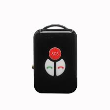

# CanTrack - P02L

The P02L Smart Walkie-Talkie Tracker is a compact 4G personal GPS tracker purpose-built for outdoor safety and seamless Plaspy compatible integration. Combining LTE/GPRS connectivity with multi‑constellation positioning \(GPS + BeiDou + LBS\) and an LTE Cat 1 SIMCom A7670SA module, the P02L delivers reliable real‑time tracking with reported accuracy under 5 meters CEP. Its global walkie‑talkie \(intercom\) capability and voice call support make it a standout GPS tracker for users who need both location telemetry and long‑range two‑way voice communication.

Designed for seniors, children, hikers, lone workers and small teams, the P02L offers SOS/panic buttons, fall‑down detection, timed wake/sleep schedules, step counting and Bluetooth accessory support. As a Plaspy compatible device, it can stream position, status and alarm data into Plaspy for real‑time monitoring, fleet management style configuration, and centralized alerting—while OTA updates and SMS commands simplify remote device management.

## Key Highlights

- Plaspy compatible GPS tracker for reliable real‑time tracking and centralized telemetry ingestion.
- Global walkie‑talkie \(intercom\) and voice call support over the mobile network for voice communication across any distance.
- Multi‑constellation positioning \(GPS + BeiDou + LBS\) with location accuracy \<5 m CEP for precise location updates.
- Dedicated safety features: SOS/panic button, fall‑down detection and family number configuration for quick emergency contact.
- Long battery life: 1300mAh rechargeable cobalt battery with ultra‑low standby current for extended deployments.
- Remote management via OTA updates and SMS commands for group configuration, mode changes, and maintenance.
- Built‑in sensors: 6‑axis gyro \(G‑sensor\) and step counter plus Bluetooth support for local sensors or accessories.

## How It Works with Plaspy

Integration with Plaspy uses the P02L’s LTE/GPRS data channel to send location, telemetry and event notifications to the Plaspy platform. Position fixes, sensor telemetry and alarm events are forwarded in near real‑time so dispatchers, caregivers or operations teams can view status, create alerts and run reports from a single dashboard. Remote configuration and group management are supported through the device’s OTA and SMS command interfaces, enabling scalable fleet management and personal safety profiles.

- Real‑time location and telemetry updates \(GPS + BeiDou + LBS\) to Plaspy for mapping and historical tracks.
- SOS, panic button and fall‑down alarm reporting as priority events for immediate alerts.
- Step counting and motion data as additional telemetry for activity monitoring.
- Bluetooth sensors and accessory pairing for local sensor data collection and proximity functions.
- Remote configuration: mode switching, intercom group setup and device reboot via SMS or OTA without physical access.

## Technical Overview

| Connectivity | LTE / GPRS \(LTE Cat 1 module: SIMCom A7670SA\) |
| --- | --- |
| Bands | GSM 850/900/1800/1900 MHz; LTE‑FDD B1/B2/B3/B4/B5/B7/B8/B28/B66 |
| Positioning | GPS + BeiDou + LBS; location accuracy &lt;5 meters CEP |
| Module & Chipset | SIMCom A7670SA \(LTE Cat 1\) |
| Battery | 1300mAh rechargeable pure cobalt battery |
| Charging | 5V DC charging |
| Power Consumption | Average working current &lt;110mA; Standby &lt;3mA \(intercom off\) / &lt;10mA \(intercom on\) |
| Sensors | 6‑axis gyro \(G‑sensor\); step counter |
| Bluetooth | BLE supported for accessory pairing |
| Remote Management | OTA firmware updates; SMS command configuration for SOS, intercom groups, wake alarms, IP/APN and more |
| Operating Temperature | −20°C to +60°C |
| Dimensions | 68.7 × 43.9 × 20.2 mm \(compact, wearable/handheld form factor\) |
| Advanced Features | Global intercom, voice calls, SOS, fall‑down alarm, timed wake/sleep schedules, panic button |

## Use Cases

- Personal safety for seniors and children: fall detection, SOS alerting and family number reachability with Plaspy monitoring.
- Outdoor recreation and hiking: real‑time tracking, global intercom for group coordination and emergency voice contact anywhere coverage is available.
- Lone worker and patrol safety: step telemetry, panic button and remote configuration for teams managed via Plaspy.
- Guided tours and field teams: intercom groups for instant voice coordination plus centralized tracking for supervisors.
- Pet‑person or asset accompanied tracking: compact form factor and Bluetooth accessory support for mixed tracking scenarios.

## Why Choose This Tracker with Plaspy

The P02L delivers a balanced mix of accurate GPS tracking, long standby life and a unique global walkie‑talkie function that expands a Plaspy compatible deployment from simple location tracking to full voice‑enabled safety communications. Its LTE Cat 1 connectivity and multi‑constellation positioning translate into dependable real‑time tracking and telemetry for both personal and small‑fleet use. Remote OTA updates and comprehensive SMS commands reduce maintenance overhead and enable fleet management workflows without physical recall.

While the P02L focuses on personal safety and team voice communications rather than vehicle‑specific functions like fuel monitoring, ignition sensing or an immobilizer, its telemetry, SOS and Bluetooth sensors integrate smoothly with Plaspy for anti‑theft alerts, activity monitoring and centralized reporting. For organizations and families seeking a Plaspy compatible GPS tracker that pairs live tracking with long‑range voice intercom and low‑power operation, the P02L is a reliable, easy‑to‑manage option.

