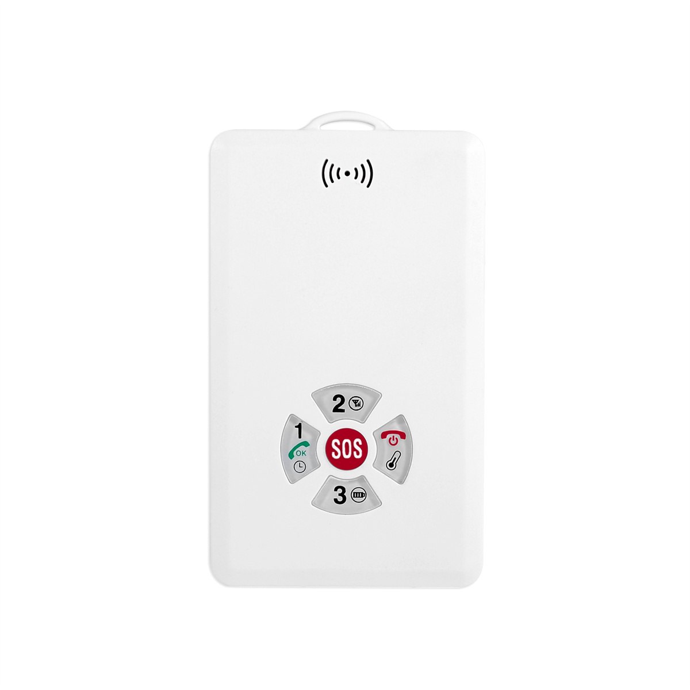

# CanTrack - P60L

The CanTrack P60L is a compact personal GPS tracker designed for reliable real time tracking, two way voice communication and environmental telemetry. Built around GNSS positioning that uses GPS and BeiDou, and cellular data connectivity, the P60L targets personal safety and asset monitoring scenarios where location accuracy, SOS alerts and temperature readings are important. It includes offline logging and remote management features to preserve history and simplify updates.

As a Plaspy compatible device, the P60L streams location and sensor data to Plaspy for visualization, alerts and reporting. Its combination of real time position updates, voice capable communications and onboard temperature sensing makes it a practical choice for organizations that want to add personal safety devices or temperature aware asset trackers into Plaspy powered workflows without complex integration work.

## Key Highlights

- Plaspy compatible for seamless real time tracking and alerting with minimal integration effort
- 4G LTE and GPRS connectivity for broad cellular coverage and low latency telemetry
- GNSS positioning using GPS and BeiDou with high accuracy for reliable location reporting
- Two way voice capability and an SOS alarm button for direct emergency response
- Onboard temperature monitoring for environmental telemetry and threshold alerts
- Internal backup battery with configurable sleep and real time modes for extended standby
- Offline logging of location records to preserve history when coverage is intermittent

## How It Works with Plaspy

The P60L transmits GNSS position fixes and sensor telemetry over cellular links to Plaspy where the data is visualized on maps, trended in reports and used to drive automated alerts and workflows. Plaspy receives SOS events, voice related incidents and temperature readings to support monitoring, response and compliance use cases.

- Real time location and telemetry updates appear in Plaspy dashboards for live monitoring
- SOS alarm events and voice notifications surface immediately to operators for fast response
- Temperature telemetry feeds into Plaspy rules for environmental alerts and reporting
- Offline logged points upload to Plaspy when connectivity is restored to preserve history
- Remote configuration and firmware update options simplify fleet scale management via Plaspy compatible methods

## Typical Use Cases

- Personal safety and elder care monitoring with SOS button and two way voice
- Child location tracking and lone worker protection with real time alerts
- Asset monitoring where temperature telemetry matters for cargo or equipment
- Portable equipment and pet tracking with offline logging during coverage gaps

## Why Choose This Tracker with Plaspy

The P60L combines reliable GNSS positioning, cellular connectivity and voice enabled telemetry in a compact package that fits into Plaspy workflows for tracking, alerting and reporting. Its onboard temperature sensing and offline logging provide continuity of data in environments with intermittent coverage, while remote update and configuration capabilities reduce management overhead for larger deployments.

To learn more about how Plaspy can use the P60L for tracking and operational oversight visit https://www.plaspy.com. Product specifications, availability and manufacturer details can change over time, so please verify current technical specifications and support information on the manufacturer site https://www.cantrackgps.com/ before finalizing deployments.
