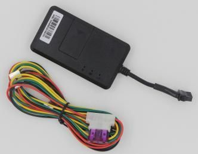

# CanTrack - TK06A

The CanTrack TK06A is a versatile GPS tracker designed for vehicle tracking and monitoring. It utilizes the existing GSM/GPRS network and GPS satellites to accurately locate and monitor remote targets. With its compact design and built-in GPS and GSM modules, the TK06A can capture GPS data and send it to authorized mobile numbers via SMS. Users can easily track the current location of their vehicles on their phones or through popular mapping platforms like Google Earth or Google Maps. Additionally, the GPS data can be transmitted via GPRS to an internet server, enabling real-time tracking on a computer.

The TK06A is suitable for a variety of applications, including vehicle rental and fleet management, motorcycle/scooter/bike anti-theft, motorcycle/scooter/bike real-time tracking, and personnel management. It offers a range of useful features, such as real-time tracking location by SMS/GPRS, real-time voice monitoring, password recovery, authorized number setting, device rebooting, overspeed and power failure alarms, ACC anti-theft alarm, and the option to connect an external relay for controlling the vehicle's oil and circuit. Additionally, the TK06A can be equipped with a built-in backup battery for power failure alarm functionality.

Key Features:

- GSM quad-band frequency for global use
- Real-time tracking location by SMS/GPRS
- Real-time voice monitoring function
- Password recovery
- Authorized number setting
- Device rebooting
- Overspeed and power failure alarms
- ACC anti-theft alarm
- Option to connect external relay for vehicle control
- Built-in backup battery for power failure alarm \(optional\)

