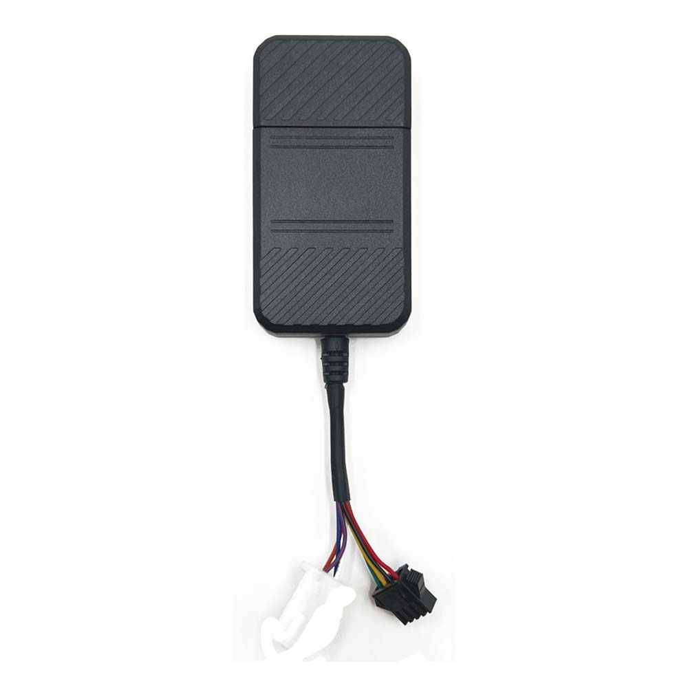

# CanTrack - TK08AL

The CanTrack TK08AL is a 4G hard wired car GPS tracker built for reliable vehicle security and driver management. Designed around cellular and GNSS positioning hardware, the TK08AL provides continuous location reporting, movement and ignition detection, SOS and speeding alerts, and power cut protection with an onboard backup battery. Its combination of driver identification and optional immobilizer controls makes it suitable for a wide range of vehicle security and fleet workflows.

As a Plaspy compatible device out of the box, the TK08AL can stream location and event telemetry into Plaspy for centralized monitoring and reporting. That compatibility makes it straightforward to include TK08AL equipped vehicles in Plaspy fleets so operators can receive live alerts, view trip history, and apply driver authorization rules alongside other fleet data within the Plaspy platform.

## Key Highlights

- Plaspy compatible for real time tracking and centralized fleet management across vehicles and assets
- Built in RFID driver identification with support for external reader integration to enforce authorized use
- Movement and ignition detection plus SOS and speeding alerts for rapid operational awareness
- Power cut alarm and internal backup battery to detect tampering and provide short term operation during outages
- Optional relay based immobilizer capability to support anti theft and remote disable workflows
- Local data buffering and configurable update behavior to preserve location history during connectivity gaps

## How It Works with Plaspy

When connected, the TK08AL delivers position updates and vehicle events into Plaspy so fleet managers can monitor status and respond through a single interface. Plaspy ingests the tracker telemetry and presents it alongside other fleet data for visibility, alerting, and reporting.

- Real time location and telemetry updates for live map views and status monitoring in Plaspy
- Movement and ignition events used for trip segmentation and live status indicators on dashboards
- Driver identification events from RFID sources recorded in Plaspy for operator logs and audits
- Power cut and backup battery events forwarded as alerts to detect tampering or loss of main power
- Optional immobilizer events and control signals can be represented in Plaspy workflows for anti theft response

## Typical Use Cases

- Fleet anti theft and immobilization where remote disable and power cut alerts are required
- Driver authorization and compliance tracking using RFID based identification and event logs
- Logistics and route monitoring for real time position updates and trip history
- Mixed vehicle deployments including cars, motorcycles, and light electric vehicles thanks to wide input range and low power standby
- Remote telemetry buffering to preserve event history when coverage is intermittent

## Why Choose This Tracker with Plaspy

Pairing the TK08AL with Plaspy provides a practical solution for organizations that need both security features and operational oversight. The tracker combines reliable positioning and cellular connectivity with driver level controls and anti theft options, and Plaspy consolidates those telemetry streams for centralized management, alerting, and reporting.

If you want a compact device that supports driver ID, power cut detection, and optional immobilizer workflows while feeding real time and historical data into a fleet platform, the TK08AL is a suitable candidate to evaluate alongside Plaspy. Learn more about Plaspy on the main website https://www.plaspy.com and verify current product specifications and availability with the manufacturer at https://www.cantrackgps.com/ as product details and documentation can change over time.
