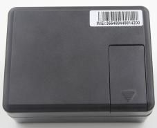

# CanTrack - TK200

The CanTrack TK200 is a cutting-edge GPS tracker that combines the power of GSM/GPRS network and GPS satellites to provide a comprehensive tracking solution. This versatile device offers a range of features including tracking, listening, tracing, and anti-theft capabilities, making it an ideal choice for both personal and commercial use.

With the CanTrack TK200, you can easily locate and monitor any remote target using SMS or GPRS. Whether you need to keep an eye on your vehicle, track the whereabouts of a loved one, or monitor the movements of your assets, this tracker has got you covered.

Some of the outstanding features of the CanTrack TK200 include:

- Remote switch on and off: Control the tracker remotely, allowing you to conserve battery life when not in use.
- Single Tracking: Get real-time updates on the location of your target.
- Monitoring: Listen in to the surroundings of the tracker for added security and peace of mind.
- Data Storage: Store historical tracking data for future reference and analysis.
- Geo-fence alarm: Set up virtual boundaries and receive alerts when the tracker enters or exits the designated area.
- Movement alarm: Be notified when the tracker starts moving.
- Overspeed alarm: Set a speed limit and receive alerts when the tracker exceeds it.
- Vibration alarm: Detect any unauthorized tampering or movement of the tracker.
- Set all alarm mode: Customize the alarm settings to suit your specific needs.
- Sound Triggered callback: Trigger a callback to a predefined number when a sound is detected.
- Check the vehicle state: Monitor the status of your vehicle, including battery voltage and GPS signal strength.

With its advanced features and reliable performance, the CanTrack TK200 is a top choice for anyone in need of a high-quality GPS tracker. Whether you're a concerned parent, a fleet manager, or a security professional, this tracker will provide you with the peace of mind and real-time information you need.

