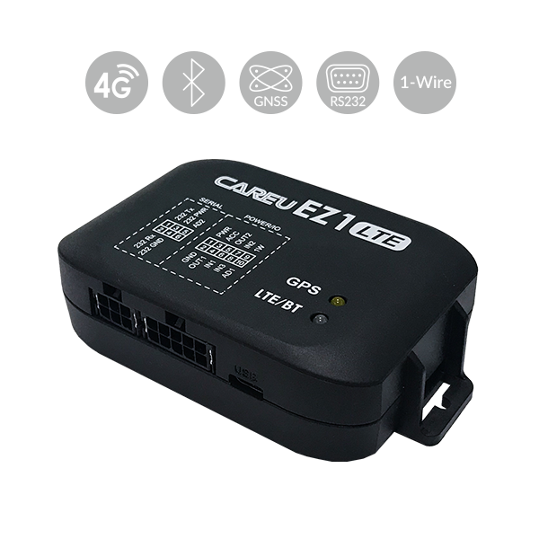

# CAREU - EZ1

The CAREU EZ1 is a small and compact Automatic Vehicle Location tracker designed for practical vehicle tracking and fleet management. It supports global LTE with 3G and 2G fallback, GPS and GLONASS satellite positioning, and Bluetooth 3.0, delivering the core capabilities needed to monitor vehicle locations and basic telematics in a cost effective package. The device is available in multiple versions to suit different connectivity and accessory needs, and its discreet form factor makes it suitable for installations where space is limited.

As a Plaspy compatible device, the EZ1 can feed location and event data into the Plaspy platform to provide live visibility and historical reports for fleets. Plaspy can ingest the EZ1's position updates, geofence events, odometer readings, and accelerometer based motion events so fleet managers gain operational oversight without changing workflow. The combination of the EZ1 hardware and Plaspy software supports common fleet monitoring needs across logistics, rental, delivery, and service operations.

## Key Highlights

- Compact and discreet design suitable for tight installation spaces
- Global LTE support with 3G and 2G fallback for broad coverage
- GPS and GLONASS satellite positioning for reliable location data
- Bluetooth 3.0 for two way voice communication and remote configuration
- Built in 3 axis accelerometer for detecting harsh events and impacts
- Support for external accessories and interfaces such as 1 Wire and RS232
- High capacity logging and FOTA update capability for maintenance

## How It Works with Plaspy

The CAREU EZ1 transmits position and event data that Plaspy uses to deliver fleet visibility, alerts, and reporting. Once the EZ1 is connected to Plaspy, vehicle movements and key events become part of a unified fleet view enabling monitoring and analysis across assets.

- Live and historical location tracking inside the Plaspy dashboard
- Geofence event reporting for circular and polygonal zones
- Event alerts based on accelerometer detections such as harsh braking or impacts
- Odometer and position log data available for route and usage reporting
- Integration of accessory data where supported for extended monitoring
- Remote firmware update status and device configuration seen through Plaspy where available

## Typical Use Cases

- Fleet management for logistics and delivery operations
- Vehicle rental and sharing services needing discreet tracking
- Utility and field service fleets monitoring vehicle activity
- Vehicle financing and asset protection where reliable tracking is needed
- Driver behavior observation and basic safety event reporting

## Why Choose This Tracker with Plaspy

The EZ1 is a practical choice when organizations need a compact, cost effective tracker that covers the essentials of vehicle location and basic telematics. Its global connectivity options and support for satellite positioning make it suitable for mixed fleets operating in varied coverage areas, and the inclusion of accelerometer events and accessory interfaces enables broader operational use without adding complexity.

Paired with Plaspy, the EZ1 becomes part of a scalable monitoring solution that turns device data into actionable insights for fleet operators. Plaspy provides centralized visibility, alerts, and reporting that help teams manage assets and operations more efficiently while leveraging the EZ1 hardware capabilities.

To learn more about Plaspy and how the CAREU EZ1 can integrate with your fleet management workflow visit https://www.plaspy.com. Product specifications and manufacturer details can change over time, so please verify the latest information on the manufacturer site https://www.systech-iot.com/ before making purchasing or deployment decisions.
