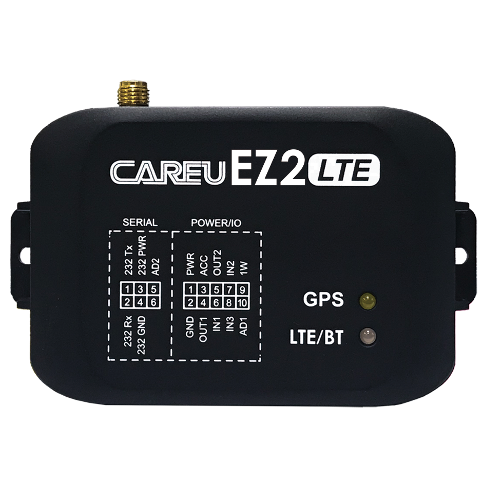

# CAREU - EZ2

The CAREU EZ2 is a compact vehicle tracker designed for fleet management and asset monitoring. Built to deliver real time tracking and vehicle telemetry, the EZ2 supports 4G LTE connectivity with fallback to 2G and reads vehicle diagnostics via U1Lite plus CAN and OBD II interfaces. Its feature set includes fuel monitoring, odometer and RPM reporting, engine temperature diagnostics, anti theft immobilization and support for accessory peripherals such as RFID readers and temperature sensors.

As a confirmed Plaspy compatible device, the EZ2 can feed location and vehicle state data directly into Plaspy dashboards for centralized monitoring and operational oversight. The combination of telemetry, onboard logging and remote management capabilities makes the EZ2 a practical choice for organizations that want to consolidate tracking, geofencing, alerts and basic remote control within the Plaspy platform.

## Key Highlights

- Plaspy compatible for real time tracking and vehicle telemetry integration
- 4G LTE connectivity with 2G fallback and regional or global module options
- U1Lite plus CAN and OBD II data reading for fuel level, odometer, RPM and engine temperature
- Anti theft immobilizer with remote engine immobilization capability
- Advanced geofencing with capacity for many configurable zones and speed notifications
- Large onboard data logging capacity to retain records during offline periods
- Accessory support via RS 232 and optional 1 Wire port for RFID i Button and temperature sensors

## How It Works with Plaspy

When paired with Plaspy, the CAREU EZ2 becomes a continuous source of position and vehicle state information for monitoring, reporting and event handling. Plaspy ingests the tracker data to present live locations, historical traces and device events while enabling remote interactions such as configuration and control where supported.

- Continuous location and telemetry streaming into Plaspy for live fleet visibility
- Vehicle diagnostics available in Plaspy dashboards including odometer, RPM and engine temperature where provided by the vehicle interface
- Fuel level and related telemetry used in Plaspy reports and alerts for fuel management
- Geofence rules and speed notifications managed in Plaspy to trigger alerts and workflows
- Remote immobilization commands initiated from Plaspy compatible control flows
- Onboard log upload and historical reporting to preserve records from connectivity gaps

## Typical Use Cases

- Logistics and delivery fleets requiring live tracking and driver assignment verification
- Fuel management and usage analysis combining telemetry with GPS traces
- Anti theft and recovery workflows using immobilization and geofence alerts
- Identification and access control using RFID or i Button integration for driver logging
- Compliance and record keeping using large onboard logs for retrospective reporting

## Why Choose This Tracker with Plaspy

The CAREU EZ2 is suitable for organizations that need a balanced mix of tracking, vehicle telemetry and basic remote control under a unified platform. Its telemetry integration and accessory support reduce the need for additional hardware when collecting fuel, odometer and driver identification data, helping projects move from pilot to scale more smoothly.

If you want to explore how the CAREU EZ2 can fit into your Plaspy deployment, learn more about Plaspy on the main website https://www.plaspy.com. Product specifications, availability and manufacturer details can change over time, so verify current technical information on the manufacturer site https://www.systech-iot.com/.
