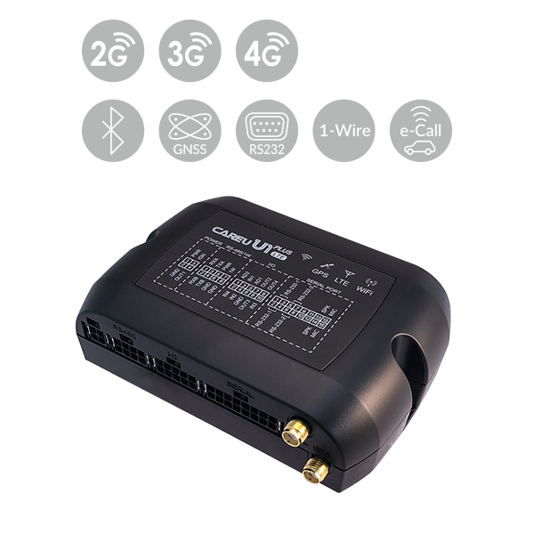

# CAREU - U1

The CAREU U1 is a feature rich vehicle tracker offered in a PLUS LTE configuration that brings GNSS positioning together with mobile connectivity and accessory integration. The device is described as including internal antennas and modules for reliable location reporting, optional Bluetooth for configuration, and a range of interfaces that allow connection to third party accessories such as cameras, RFID readers, and vehicle data sources. It also supports extended input and output options and a 1 Wire interface for external temperature monitoring, making it suitable for temperature sensitive transport.

As a Plaspy compatible device, the CAREU U1 can be used to feed location, vehicle data, accessory events, and basic environmental readings into Plaspy for operational oversight. Its combination of positioning, accessory support, and optional video or hotspot capabilities makes the U1 relevant for fleet teams that need consolidated visibility and reporting inside Plaspy without replacing existing telematics workflows.

## Key Highlights

- GNSS positioning with internal antenna design for consistent location reporting
- Broad mobile connectivity and fallback options for resilient data delivery
- Support for accessory integration including cameras, RFID readers, and external sensors
- Vehicle data reading capability to surface diagnostic and operational information
- Extended inputs and a 1 Wire interface suitable for temperature monitoring on refrigerated loads
- Optional WiFi for video transmission and hotspot style connectivity where supported

## How It Works with Plaspy

When paired with Plaspy, the CAREU U1 delivers a continuous stream of vehicle position and event data that Plaspy can present alongside other fleet information. Plaspy ingests the device data and makes it available for monitoring, alerts, and reporting to help teams manage operations from a single platform.

- Live and historical location tracking visible in Plaspy dashboards and maps
- Integration of vehicle sourced data and accessory events into Plaspy reports
- Geofence and movement alerts routed through Plaspy for operational notifications
- Temperature and input events available for monitoring cold chain or sensitive cargo workflows
- Video and camera events referenced in Plaspy where the device transmits compatible media or timestamps
- Aggregated reporting for odometer and usage data to support fleet maintenance and planning

## Typical Use Cases

- Regional and long haul fleet tracking with consolidated location and vehicle data
- Refrigerated transport monitoring where temperature inputs are required for compliance
- Video enabled monitoring for safety and incident review when paired with compatible cameras
- Driver and vehicle behavior oversight using vehicle data and event detection
- Asset and trailer tracking where accessory integration expands telemetry beyond location

## Why Choose This Tracker with Plaspy

The CAREU U1 is a practical option for organizations that need a flexible tracker capable of integrating multiple data sources into a single fleet management view. Its accessory interfaces and temperature monitoring options extend the basic location capability, which helps operations teams using Plaspy to consolidate tracking, environmental monitoring, and camera events without separate point solutions.

Because the U1 is described as supporting a wide range of vehicle and accessory integrations, it can be a useful fit for mixed fleets and specialized applications such as refrigerated transport or video assisted workflows. Plaspy can take the data the U1 provides and convert it into actionable visibility, alerts, and reports that suit daily operations and long term analysis.

To learn more about how Plaspy can work with devices like the CAREU U1 visit https://www.plaspy.com. Product specifications availability and manufacturer details can change over time so please verify current specifications with the manufacturer documentation at https://www.systech-iot.com/
