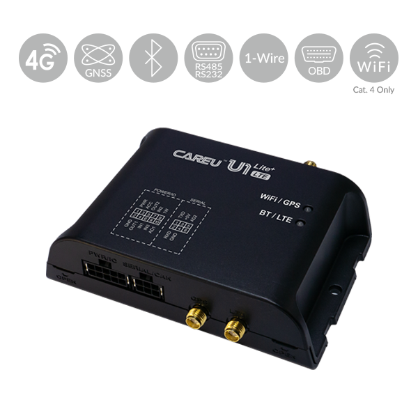

# CAREU - U1 Lite+

The CAREU U1 Lite+ LTE is a highly advanced and cost-effective GPS tracker that offers a wide range of features and capabilities. It supports 4G \(LTE Cat 4 or Cat 1\) network connectivity, with fallback options to 3G \(UMTS\) and 2G \(GSM\). In addition to GPS tracking, this tracker also provides WiFi connectivity and internet access, allowing for video transmission through compatible cameras. This makes it an ideal choice for applications that require real-time video monitoring.

One of the standout features of the CAREU U1 Lite+ LTE is its compatibility with various RS-232 accessories. This allows for seamless integration with accessories such as fatigue sensors, dash cams, alcohol sensors, RFID readers, and more. The tracker also comes with multiple digital and analog I/O ports and 1-Wire® support, providing flexibility for connecting additional sensors and peripherals.

Another notable feature of the CAREU U1 Lite+ LTE is its jamming detection capability. It can detect jamming attempts in 2G, 3G, and LTE networks, making it particularly useful for securing valuable goods during transportation. Additionally, the tracker can perform advanced tasks such as reading on-board computer data CAN \(J1939 or J1708\) or OBDII data, allowing for efficient fleet management and monitoring of driving behavior and fuel consumption.

With optional extension cables, the CAREU U1 Lite+ LTE can support multiple vehicle interfaces, including up to 10 digital inputs and 4 digital outputs, as well as up to 3 RS-232 ports and an RS-485 interface. This makes it a versatile solution for a wide range of tracking and monitoring applications.

Overall, the CAREU U1 Lite+ LTE is a feature-rich and reliable GPS tracker that offers advanced functionality at an affordable price. Whether you need to track vehicles, monitor driving behavior, or secure valuable assets, this tracker is a reliable choice.

### Key Features:

- Cost effective and easy installation
- Data communications by LTE / UMTS / HSPA / GPRS / EDGE, SMS, FTP
- Supports GPS / Glonass Satellite System
- Built-in 3-axis accelerometer
- Detects harsh acceleration / harsh braking / Impact detection/ Flip over detection
- Supports 1-Wire® for temperature control and driver identification through i-Button
- RS-232 interface for accessories \(Fatigue sensor, dash cam, fuel level sensor, RFID reader, Barcode, etc.\)
- 2G / 3G / 4G jamming detection
- Geofence report in circular and polygonal types
- Remote configuration
- Odometer data reading and user-defined reports
- FOTA firmware via FTP
- Power low / lost alarm
- GPS antenna tamper detect alarm
- Records up to 200,000 position logs

### Optional Features:

- Two-way voice communication
- Built-in 6-axis accelerometer
- Detects harsh cornering
- Bluetooth Interface for Wireless Configuration
- 1 to 3 RS-232 Extension Cable
- IO Extension Cable
- RS-485 Interface Cable
- WiFi Communication \(Internal Hotspot module / 4G Cat.4\)
- AES-256 Data Encryption
- Built-in OBDII or CAN \(J939or J1708\) Interpreter

