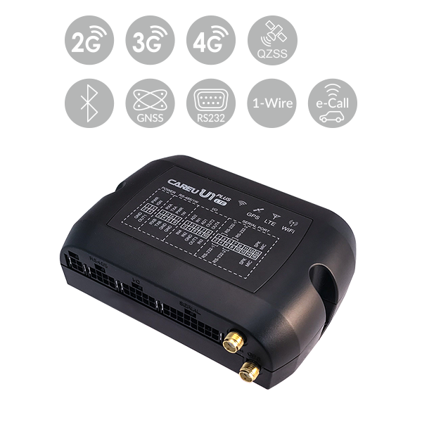

# CAREU - U1 PLUS

The CAREU U1 PLUS is a robust GPS tracker purpose-built for fleet management, heavy trucks and commercial vehicle deployments. Plaspy compatible out of the box, the U1 PLUS delivers reliable real-time tracking and rich vehicle telemetry over LTE Cat 4 / Cat 1 with fallback to 3G and 2G, making it an ideal GPS tracker for mixed-network environments and large-scale fleet operations.

Designed to integrate directly with Plaspy, the U1 PLUS brings OBD II / CAN interpreter support \(J1939 and J1708\), advanced fuel monitoring, multi-sensor expandability and driver behaviour detection into a single device. Whether you need precise fuel monitoring, video-capable installations, or secure telematics for anti-theft and smart city projects, this Plaspy compatible tracker scales to meet the demands of commercial fleets and specialized vehicle solutions.

## Key Highlights

- Plaspy compatible GPS tracker with LTE Cat 4 and Cat 1 connectivity for high-throughput real-time tracking and telemetry.
- Direct OBD II / CAN interpreter \(J1939, J1708\) — reads fuel level, odometer, RPM and engine temperature for accurate vehicle telemetry.
- Support for ultrasonic fuel sensors and analog/1-Wire temperature sensors for precise fuel monitoring and cold-chain management.
- 6-axis accelerometer for driver behaviour monitoring: harsh acceleration, braking, cornering, impacts and flip-over detection.
- Extensive connectivity options: GPS/GLONASS/QZSS \(with optional BDS/Galileo\), LTE/UMTS/HSPA/GPRS/EDGE, SMS, FTP and USSD.
- Multi-sensor expandability via RS-232 and optional RS-485 — connect dash cams, RFID readers, barcode scanners and fatigue sensors.
- Anti-theft and security features including eCall \(112\), GPS antenna tamper detection, power low/power lost alarms and GSM jamming detection \(2G/3G\).
- Remote management with FOTA \(firmware updates over FTP\) and optional AES-256 data encryption for secure deployments.

## How It Works with Plaspy

When paired with Plaspy, the U1 PLUS streams location and vehicle telemetry to the Plaspy platform using cellular links \(LTE/3G/2G\) or SMS/FTP/USSD as fallbacks. Plaspy ingests and normalizes CAN/OBD data, accelerometer events and sensor inputs so fleet managers receive consolidated, actionable data for real-time tracking, alerts and historical reporting.

- Real-time location and telemetry updates via LTE Cat 4/Cat 1 with fallback to UMTS/HSPA and GPRS/EDGE.
- Vehicle telemetry from OBD II / CAN: fuel level, odometer, RPM, engine temperature and other J1939/J1708 parameters.
- High-accuracy fuel monitoring using ultrasonic sensors and analog/1-Wire temperature sensors for cold-chain visibility.
- Driver behaviour and safety events from the 6-axis accelerometer \(harsh driving, impacts, flip-over\).
- Geofence events \(circular and polygonal\), power loss/low power alarms, antenna tamper and GSM jamming alerts forwarded to Plaspy.
- Accessory telemetry and video integrations via RS-232/RS-485 \(dash cams, RFID, barcode scanners\) for enriched monitoring and surveillance workflows.
- Wireless configuration and local pairing on supported models via Bluetooth; optional Wi‑Fi and internal hotspot on 4G Cat.4 variants for local access and video offload.

## Technical Overview

| Connectivity | LTE Cat 4 and LTE Cat 1; fallback to UMTS/HSPA \(3G\) and GPRS/EDGE \(2G\). Data: SMS, FTP, USSD. |
| --- | --- |
| Bands | Carrier-dependent LTE/UMTS/GSM bands \(supports LTE Cat 4/Cat 1 and legacy 3G/2G technologies\). |
| Power & Battery | Vehicle-powered with power low / power lost alarms; eCall \(112\) supported. \(Specification subject to change.\) |
| Interfaces | Built-in OBD II / CAN interpreter \(J1939, J1708\); RS-232 and optional RS-485 for accessories; analog and 1-Wire sensor inputs; ultrasonic fuel sensor support; DSC camera support \(3G/4G\). |
| GNSS | GPS, GLONASS, QZSS; optional broader GNSS support including BDS and Galileo. Assisted-GPS \(Ephemeris\) supported. |
| Bluetooth & Wi‑Fi | Bluetooth for wireless configuration on 4G models; optional internal/external Wi‑Fi and internal hotspot on 4G Cat.4 variants. |
| Remote Management | FOTA \(firmware updates over FTP\); data can be transmitted via FTP/SMS/USSD to backend systems such as Plaspy. Optional AES-256 data encryption available. |
| Memory & Logging | On-board logging capacity up to 200,000 position records; supports circular and polygonal geofence reporting. |
| Form Factor | Vehicle/asset-mounted tracker optimized for fleet management, heavy trucks and commercial applications. |

## Use Cases

- Fleet management and logistics: real-time tracking, RPM and odometer telemetry for route optimization and maintenance planning.
- Fuel monitoring and anti-theft: ultrasonic and OBD-derived fuel readings combined with tamper, jamming and power-loss alarms for fuel monitoring and security.
- Cold-chain transport: analog and 1-Wire temperature sensors for continuous temperature logging and alerts during refrigerated deliveries.
- Video transmission and surveillance: dash cam and DSC camera support via RS-232/RS-485 for live or recorded video linked to positional data.
- Specialized heavy vehicle deployments: garbage truck collection control, school/coach safety monitoring, agricultural asset tracking and smart city mobility projects.

## Why Choose This Tracker with Plaspy

The CAREU U1 PLUS delivers a balanced combination of connectivity, vehicle-level telemetry and expandability that makes it a strong choice for Plaspy-compatible deployments. Its built-in OBD II / CAN interpreter means you get trusted engine and fuel metrics without complex gateway hardware, while support for ultrasonic fuel sensors and temperature probes adds the precision required for cold-chain and fuel-sensitive operations. Anti-theft protections — from antenna tamper detection to GSM jamming alerts and eCall support — improve security posture for high-value fleets.

For fleet managers using Plaspy, the U1 PLUS reduces integration time by transmitting comprehensive telemetry over standard cellular protocols and offering FOTA for field maintenance. Optional AES-256 encryption, Bluetooth configuration and Wi‑Fi hotspot options on 4G models provide deployment flexibility across vehicle types and use cases. In short, the U1 PLUS is a Plaspy compatible GPS tracker designed to scale from single-vehicle anti-theft projects to enterprise fleet management with multi-sensor telemetry, video and advanced reporting.

