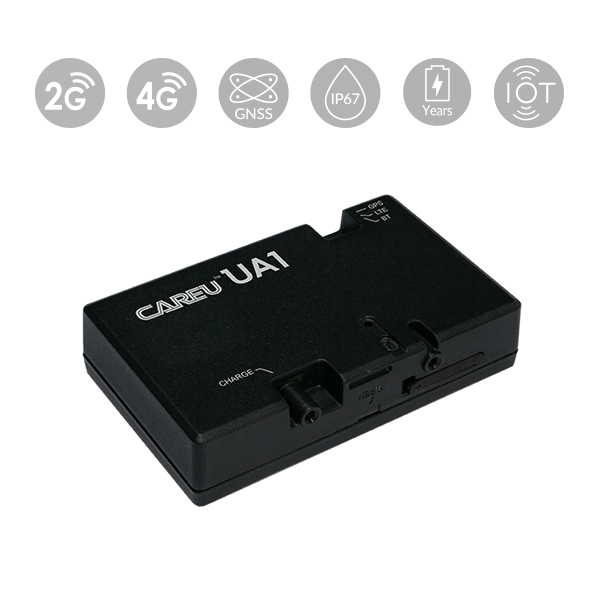

# CAREU - UA1-P

CAREU UA1-P

The CAREU UA1-P is a compact, rugged GPS tracker built for parcel and valuable-asset tracking that is fully Plaspy compatible. Designed for logistics, supply chain, and asset protection, the UA1-P delivers real-time tracking and reliable telemetry over global 4G and 2G cellular networks while withstanding harsh outdoor conditions with an IP67-rated enclosure.

The UA1-P pairs multi-constellation GNSS positioning and onboard environmental sensors with Bluetooth 4.0 local setup and rechargeable battery operation, making it ideal where small form factor, durable operation, and condition monitoring are required. When integrated into Plaspy, the UA1-P provides actionable location data, environmental telemetry, and configurable reporting profiles to optimize battery life and connectivity costs.

## Key Highlights

- Plaspy compatible for seamless real-time tracking and centralized monitoring across assets and shipments.
- Compact, IP67-rated rugged design that tolerates dust and water—ideal for outdoor logistics and long transit.
- Global cellular connectivity \(4G and 2G\) for wide-area coverage and reliable reporting in diverse geographies.
- Multi-constellation GNSS for consistent location fixes in urban and open environments.
- Environmental sensing \(temperature, ambient light, barometric pressure\) for condition-aware asset monitoring and telemetry.
- Bluetooth 4.0 local configuration for quick field setup and parameter changes without opening the housing.
- Rechargeable battery with customizable reporting intervals to balance real-time tracking needs and battery life.
- Remote parameter configuration and FTP-based firmware updates for scalable device management.

## How It Works with Plaspy

When paired with Plaspy, the CAREU UA1-P streams location and environmental telemetry into the Plaspy cloud so you can view real-time tracking, set alerts, and generate historical reports. Plaspy ingests the UA1-P’s GNSS fixes, sensor readings, and device-state messages to create actionable insights for logistics teams, security operations, and asset owners.

- Real-time location and telemetry updates delivered to Plaspy for live monitoring and geofencing.
- Environmental sensor feeds \(temperature, light, barometric pressure\) available as telemetry channels for condition-based alerts and reporting.
- Bluetooth 4.0 used for secure local configuration and quick parameter changes on-site without opening the device.
- Configurable reporting intervals and editable tracking profiles allow Plaspy to balance update frequency with battery and connectivity cost management.
- FTP-based firmware update capability and remote parameter management enable centralized maintenance through Plaspy-compatible workflows.

## Technical Overview

| Manufacturer & Model | CAREU UA1-P |
| --- | --- |
| Connectivity | Global cellular communications: 4G and 2G networks \(carrier-dependent\) |
| Bands | Global 4G / 2G support \(specific bands vary by variant and carrier\) |
| Power & Battery | Rechargeable battery; supports configurable reporting intervals to optimize battery life and connectivity costs |
| Interfaces | Bluetooth 4.0 for local configuration; multiple mounting options for parcels, containers, and fixed assets |
| GNSS | Multi-constellation GNSS positioning for accurate location in varied environments |
| Sensors | Ambient temperature, ambient light, barometric pressure |
| Bluetooth | Bluetooth 4.0 \(BLE\) for local setup and sensor interactions |
| Remote Management | Remote parameter configuration, editable real-time tracking profiles, FTP-based firmware updates, IoT cloud data collection |
| Durability & Form Factor | Compact, rugged enclosure; IP67 rated for dust and water resistance; designed for parcel and asset mounting |

## Use Cases

- Parcel tracking and delivery visibility — track shipments in real time and monitor environmental conditions during transit.
- Valuable asset protection — continuous location and condition telemetry to support anti-theft monitoring and recovery workflows.
- Logistics and supply chain monitoring — integrate UA1-P data into Plaspy for consolidated fleet and asset dashboards, alerts, and historical reporting.
- Cold-chain and condition-sensitive shipments — use onboard temperature and pressure sensors to detect deviations and trigger Plaspy alerts.
- Fixed-asset visibility — small, mountable form factor for inventory, containers, and equipment that require periodic location reporting and environment telemetry.

## Why Choose This Tracker with Plaspy

The CAREU UA1-P delivers a focused combination of durability, compact size, environmental sensing, and dependable cellular connectivity that pairs naturally with Plaspy’s real-time tracking and fleet management features. Its IP67-rated design and rechargeable battery make it a reliable choice for assets exposed to weather or rough handling, while multi-constellation GNSS and configurable reporting profiles provide the location fidelity and battery efficiency operators need for long transit cycles.

Plaspy-compatible integration simplifies deployment: remote parameter changes, editable tracking profiles, and FTP-based firmware updates reduce field visits and maintenance overhead. The UA1-P’s environmental telemetry enhances standard GPS tracker telemetry, giving logistics teams richer context for condition-based alerts and historical analysis. For organizations that also require vehicle-specific data such as ignition state, immobilizer control, or fuel monitoring, the UA1-P complements vehicle telematics units within Plaspy—enabling a holistic fleet management and anti-theft strategy without overclaiming features not present in the UA1-P itself.

In short, choose the CAREU UA1-P with Plaspy when you need a durable, compact GPS tracker that provides real-time tracking, environmental telemetry, Bluetooth-based field configuration, and scalable remote management for parcels, valuable assets, and condition-sensitive shipments.

