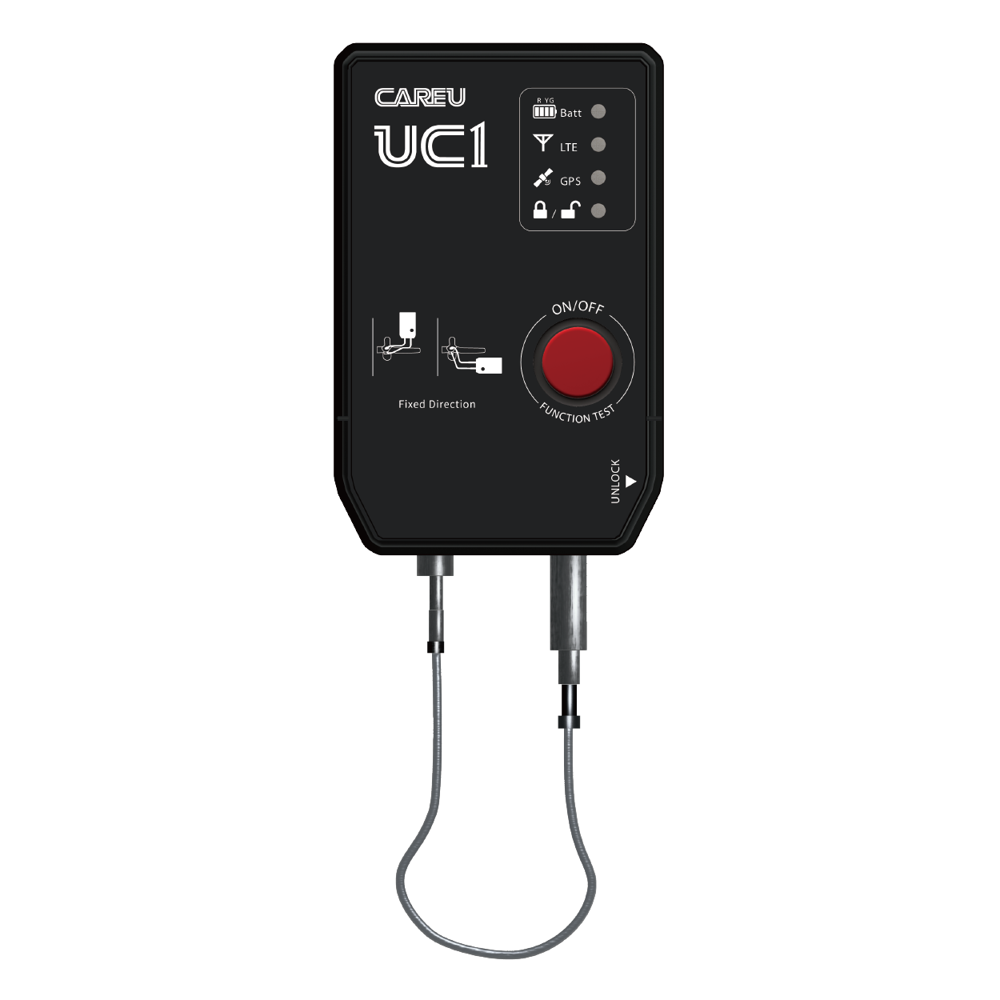

# CAREU - UC1

The CAREU UC1 is a combined GPS tracker and electronic cargo lock designed for secure container and asset sealing. Manufactured in Taiwan, the UC1 pairs mechanical protection such as a stainless steel chain and magnetic mounting with global real time tracking and tamper detection to provide continuous visibility for cargo, trailers, vans and intermodal containers.

As a Plaspy compatible device, the UC1 can be added to fleet and asset management deployments to feed location fixes, security events and device health into the Plaspy platform. That compatibility enables operators to receive immediate alerts and location updates for faster anti theft response and improved operational control while keeping audit logs of unlocking and tamper events.

## Key Highlights

- Plaspy compatible GPS tracker and electronic cargo lock for integrated fleet and cargo security workflows
- Global real time tracking with cellular connectivity and optional eSIM for wide area coverage
- Multiple unlocking options including RFID whitelist, Bluetooth mobile unlocking, and remote platform commands
- Rugged construction with IP68 dust and water protection and IK07 impact resistance for harsh logistics environments
- Tamper detection and chain cut alerts to notify operators of potential security incidents
- Large rechargeable battery for extended deployments and Type C charging for field convenience
- Compact reusable form factor with stainless steel chain and magnetic mounting for asset versatility

## How It Works with Plaspy

When paired with Plaspy, the CAREU UC1 streams position data and security events into the platform so teams can monitor assets and respond to incidents in near real time. Plaspy can consolidate UC1 inputs with other fleet telemetry to support alerting, reporting and operational workflows.

- Real time location and telemetry updates delivered to Plaspy for continuous visibility
- Door opening, tamper, vibration and chain cut alerts forwarded to Plaspy for immediate notification
- RFID and Bluetooth unlock events recorded in Plaspy logs to support access auditing
- Remote lock and unlock state updates synchronized with Plaspy to reflect device status
- Device health and battery level reporting to help schedule maintenance and manage long term deployments

## Typical Use Cases

- Container and trailer security monitoring to detect tampering or unauthorized entry during transit or storage
- Intermodal cargo tracking where reusable locks and GPS visibility are needed across ship, rail and road movements
- Protection of high value shipments with immediate chain cut and tamper alerts routed to operations teams
- Access control logging for audit trails of RFID and mobile unlocking events on containers and assets
- Augmenting fleet management by combining UC1 security events and location data with other telematics in Plaspy

## Why Choose This Tracker with Plaspy

The CAREU UC1 is suited for organizations that require a blend of mechanical sealing and electronic tracking. Its combination of physical chain security, magnetic mounting and sensor driven alerting provides a practical way to protect cargo while supplying Plaspy with actionable telemetry and event data. Rugged environmental ratings and a large rechargeable battery support deployments where reliability and low maintenance are important.

For fleet and logistics teams, the UC1 extends Plaspy capabilities by adding door level security intelligence, multi method unlocking logs and timely tamper notifications that improve incident response and auditability. If you are evaluating trackers for cargo security and asset sealing, the UC1 is a useful option to consider in Plaspy powered monitoring and reporting environments.

To learn more about using the UC1 with Plaspy visit https://www.plaspy.com. Product specifications, availability and manufacturer details can change over time so verify current specifications on the official manufacturer website https://www.systech-iot.com/.
