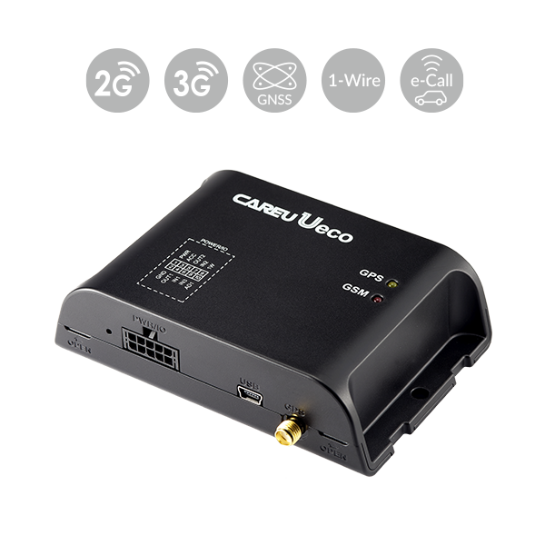

# CAREU - Ueco

The CAREU Ueco is a compact and reliable GPS tracker designed for a variety of vehicle tracking scenarios. It is positioned for use in car rental fleets, taxi operations, logistics companies, and private cars where dependable location reporting and basic telematics are required. The Ueco combines a small form factor with communication and positioning features intended to deliver consistent tracking performance for everyday fleet operations.

As a Plaspy compatible device, the Ueco can feed location data and event reports into the Plaspy platform to provide visibility and operational oversight. Its support for common data channels, geofence reporting, crash detection, odometer readings, and remote configuration makes it a practical option for organizations that want to integrate hardware with Plaspy for monitoring, alerts, and reporting without adding unnecessary complexity.

## Key Highlights

- Compact and reliable device suited for fleet, rental, taxi, logistics, and personal car tracking
- Compatibility with U1Lite+ cables for flexible installation and cross model use
- 1-Wire interface available while the device is in sleep mode for low power monitoring tasks
- Built in high gain GSM and GNSS antennas to improve signal reception and positioning consistency
- Supports data communications via UMTS HSPA GPRS EDGE plus SMS FTP and USSD for multiple reporting channels
- Built in crash detection for harsh acceleration harsh braking and impact detection to help monitor driver behavior

## How It Works with Plaspy

The CAREU Ueco can transmit position updates and event data to Plaspy where that information becomes part of fleet dashboards reports and alerts. Plaspy ingests incoming messages from compatible trackers like the Ueco to provide location history, event notifications, and operational reports that help teams manage vehicles and drivers.

- Real time and configurable position updates visible on Plaspy maps for location monitoring
- Geofence events in circular or polygonal formats can trigger alerts and be logged in Plaspy reports
- Crash detection and harsh event notifications can be surfaced as safety alerts for operational oversight
- Odometer readings and user defined reports can feed Plaspy analytics for usage and maintenance planning
- Remote configuration options and FOTA support enable device settings and firmware updates when coordinated through supported channels

## Typical Use Cases

- Car rental fleet tracking for location control usage monitoring and return management
- Taxi and ride fleet oversight to monitor vehicles driver behavior and service coverage
- Logistics vehicle tracking for route visibility asset monitoring and performance reporting
- Personal car tracking for theft deterrence simple fleet style monitoring and safety alerts
- Driver behavior monitoring where crash and harsh event reporting supports safety programs

## Why Choose This Tracker with Plaspy

The CAREU Ueco presents a balanced option for organizations that need a compact tracker with practical telematics features. Its blend of reliable positioning antenna design multiple communication channels and event reporting makes it suitable for everyday fleet management tasks without adding unnecessary complexity. For fleets and operators using Plaspy the Ueco offers the kinds of data that feed core visibility features such as mapping notifications and basic reporting.

Because the Ueco supports remote configuration geofence reporting and crash detection it can extend Plaspy workflows for safety alerts and operational reporting. Optional features such as two way voice and additional satellite system support can increase capability in regions or deployments where those options are desirable. To learn more about Plaspy and how compatible devices like the CAREU Ueco integrate with our platform visit https://www.plaspy.com. Product specifications availability and manufacturer details can change over time so please verify current specifications on the manufacturer site https://www.systech-iot.com/
