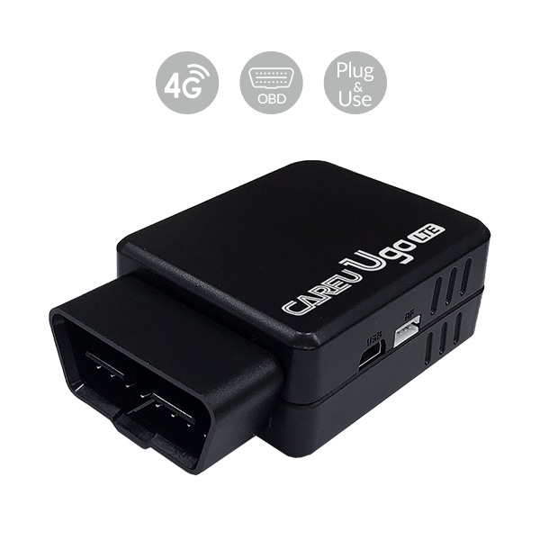

# CAREU - Ugo

The CAREU Ugo is a plug and use OBD II GPS tracker built for fast deployment and continuous vehicle telemetry. Designed to be connected directly to a vehicle OBD II port, Ugo provides location updates and vehicle data while keeping installation simple. It includes built in antennas, an internal backup battery, and a 6 axis accelerometer to capture driving events alongside OBD II information such as odometer where the vehicle exposes it.

Ugo is Plaspy compatible out of the box, making it a practical choice for fleets and organizations that want to bring telematics into a Plaspy instance quickly. With multi generation cellular connectivity and options for a standard SIM or integrated eSIM, the tracker is intended for scalable rollouts and remote management, allowing Plaspy users to ingest live positions, behavior events, and vehicle telemetry without complex device onboarding.

## Key Highlights

- Plug and play OBD II form factor for fast deployment and minimal installation time.
- Multi generation cellular connectivity for broad coverage and reliable data delivery.
- Built in GPS and GSM antennas with an internal backup battery for continued reporting.
- 6 axis accelerometer to capture harsh driving, impact, and flip over events.
- Onboard OBD II data reading including odometer to enrich fleet telemetry.
- Large local logging capacity to retain position history during connectivity gaps.
- Support for remote configuration and firmware updates to simplify device management.

## How It Works with Plaspy

When integrated with Plaspy, the Ugo forwards location points and vehicle telematics into Plaspy for live monitoring, alerts, and historical reporting. OBD II readings and accelerometer events become part of fleet workflows for driver coaching, trip analysis, and security monitoring. Remote configuration and firmware updates help keep devices aligned with Plaspy reporting needs across a deployed fleet.

- Real time location updates streamed to Plaspy for mapping and dispatch visibility.
- Engine and ignition status reporting to segment trips and measure vehicle use.
- OBD II telemetry including odometer data where available to support reporting.
- Harsh driving and impact events sent as alerts to inform driver behavior workflows.
- Optional immobilizer or relay accessories can be managed through Plaspy workflows where configured.
- Bluetooth enabled variants support sensor and beacon context to extend asset visibility.

## Typical Use Cases

- Delivery and courier fleets needing live tracking geofence alerts and behavior analytics.
- Light commercial and utility vehicles requiring OBD II telemetry and odometer reporting.
- Security and patrol fleets that prioritize anti theft monitoring and rapid deployment.
- Consumer and end user vehicles for plug in anti theft alerts ignition reporting and driving feedback.
- Mixed fleets using Bluetooth sensors for temperature cargo or proximity context with compatible variants.

## Why Choose This Tracker with Plaspy

CAREU Ugo is well suited to organizations that want a balance of simple installation and meaningful vehicle telemetry in a Plaspy enabled environment. Its plug and play OBD II design reduces rollout complexity while multi generation cellular support and eSIM options help scale deployments across regions. The combination of accelerometer event detection and OBD II data provides the kinds of inputs Plaspy uses for driver scoring, fuel and mileage reporting, and security alerts.

If you are evaluating a compact OBD II tracker for Plaspy based fleet management, Ugo offers an efficient path to live tracking and remote device management. Learn more about Plaspy on the main website https://www.plaspy.com and verify current specifications availability and manufacturer details on the official CAREU site https://www.systech-iot.com/ as product details can change over time.
