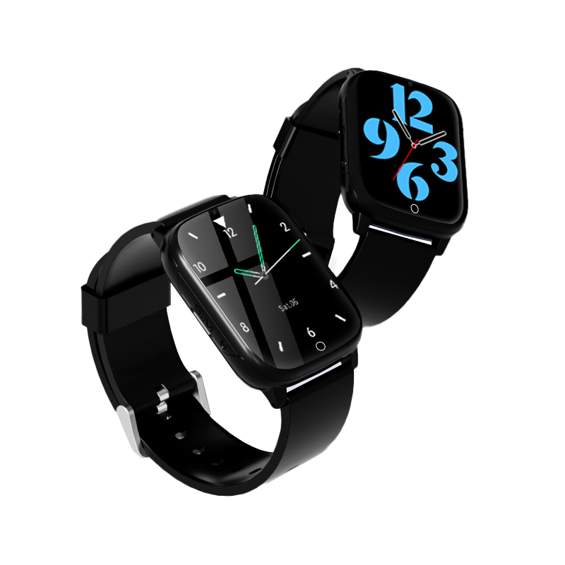

# CAREU - uWatch WT1 Lite

The CAREU uWatch WT1 Lite is a compact wearable GPS tracker in a smartwatch form factor designed for personal safety and continuous wellness monitoring. It combines location tracking with health telemetry such as heart rate, blood pressure, and oxygen saturation, and includes practical safety features like an SOS button and geofence notifications to help caregivers respond quickly when incidents occur.

As a device compatible with Plaspy, the uWatch WT1 Lite can feed location and health data into a centralized monitoring platform for consolidated visibility and alerting. That compatibility makes the watch attractive for family caregivers, care teams, and organizations that want to integrate wearable safety devices into a broader tracking and notification workflow using Plaspy.

## Key Highlights

- Plaspy compatible wearable GPS tracker designed for real time tracking and historical playback.
- Dedicated SOS emergency button for fast alerts to designated caregivers and monitoring teams.
- Geofence notifications to warn authorized users when the wearer enters or leaves predefined safe areas.
- Continuous health telemetry reporting including heart rate blood pressure and SpO2 for remote caregiving insight.
- Activity and wellness features such as pedometer sleep tracking and sedentary reminders to support everyday monitoring.
- Multi user caregiver support and multilingual interface to share alerts and data among family and professional carers.

## How It Works with Plaspy

When integrated with Plaspy the uWatch WT1 Lite becomes part of a unified monitoring environment where location updates and health telemetry can be visualized and acted on alongside other assets. Plaspy enables centralized alert routing and historical reporting so caregivers and operators can maintain situational awareness and coordinate responses.

- Real time location updates and historical GPS playback visible within Plaspy for incident review.
- SOS events forwarded to Plaspy to trigger immediate notifications and escalation workflows.
- Geofence rules set up in Plaspy to generate alerts when safe zones are breached.
- Health telemetry such as heart rate blood pressure and SpO2 consolidated for authorized viewers to support remote care.
- Activity and sleep data included in monitoring dashboards to correlate events and support wellness programs.

## Typical Use Cases

- Elderly care where combined location and vital sign visibility helps manage wandering risks and health events.
- Child safety monitoring with geofence alerts and SOS notifications for rapid parent or guardian response.
- Lone person or remote worker oversight to provide situational awareness and emergency alerting.
- Daily wellness and activity tracking for preventive care and lifestyle monitoring.
- Shared caregiving scenarios where multiple authorized users need access to alerts and historical records.

## Why Choose This Tracker with Plaspy

The uWatch WT1 Lite is purpose built for personal protection and wellness monitoring rather than vehicle or asset management. Its wearable form factor and combination of location plus health telemetry make it well suited to caregiving contexts where quick alerts and continuous visibility matter. Using this device with Plaspy lets organizations consolidate those data streams into a single platform for clearer oversight and coordinated responses.

If you need a compact wearable that brings together GPS based safety features and ongoing health measurements, the uWatch WT1 Lite paired with Plaspy provides a practical option for families and care teams looking to centralize monitoring and alerts. Learn more about Plaspy at https://www.plaspy.com and verify current product specifications and availability on the manufacturer site https://www.systech-iot.com/. Product specifications and features can change over time so confirming details with official manufacturer documentation is recommended.
