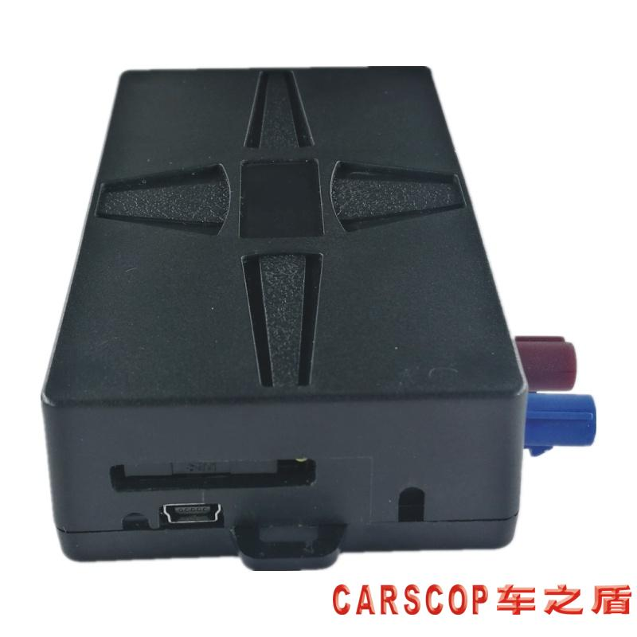

# Carscop - CC-368

The CC-368 is a purpose built 4G T Box designed for vehicle telematics in car rental, car sharing and remote fleet management. It combines cellular connectivity across 2G 3G and 4G LTE with a U‑Blox GNSS module with A GPS and external antennas to provide continuous positioning. Integrated vehicle interfaces such as OBD II CANBUS, Bluetooth access and multiple inputs and outputs make the unit suitable for telemetry collection and controlled vehicle interactions in managed fleets.

As a Plaspy compatible device out of the box, the CC-368 is a practical option for operators who want to bring vehicle location diagnostics and access control into a single platform. When paired with Plaspy the unit can stream location and vehicle parameters, deliver event based alerts, and support remote immobilizer and engine start workflows while preserving offline track logging and backup power for continuity during network interruptions.

## Key Highlights

- Plaspy compatible real time GPS tracker designed for car rental car sharing and fleet operations
- Global cellular connectivity across 2G 3G and 4G LTE with external 4G and GPS antennas for reliable coverage
- OBD II CANBUS integration for vehicle diagnostics DTC reads and telemetry forwarding where supported
- Multiple access options including Bluetooth BLE NFC or touch pad for keyless and proximity based workflows
- Remote immobilizer and remote engine start support for secure anti theft and unattended rental scenarios
- Internal track logging and backup battery with power down alarm to maintain data continuity during outages
- FOTA firmware updates and TCP IP API access to support integrations and custom server side workflows

## How It Works with Plaspy

When connected to Plaspy the CC-368 streams GNSS location and vehicle telemetry to the platform so operators can monitor assets, respond to events and manage remote access from central dashboards. Data and commands flow between the device and Plaspy over network links with fallback logging and message delivery options to help maintain visibility during connectivity issues.

- Real time location updates and historical route logging visible in Plaspy dashboards
- Event forwarding to Plaspy for ignition door shock and other alarm conditions to trigger alerts and automations
- OBD II CANBUS parameters and DTC information sent to Plaspy for diagnostics and maintenance workflows where supported by the vehicle
- Remote immobilizer and engine start commands executed via Plaspy when configured and authorised
- Offline track storage on the device with automatic upload to Plaspy when connectivity is restored
- API and TCP interfaces enabling custom reporting scheduled exports and integration with back office systems

## Typical Use Cases

- Unattended car rental and car sharing requiring keyless entry and central access control
- Centralized fleet management with live tracking diagnostics and scheduled telemetry reporting
- Anti theft and recovery workflows using remote immobilizer and alarm reporting
- Remote diagnostics and maintenance planning based on forwarded vehicle parameters and DTCs
- Mixed fleet deployments where broad vehicle support and wide operating voltage simplify installation

## Why Choose This Tracker with Plaspy

The CC-368 pairs practical vehicle interfaces and access control features with Plaspy to support both operational visibility and controlled remote interactions. Its combination of OBD II CANBUS telemetry, proximity access options and built in backup mechanisms helps reduce operational friction for car sharing and rental programs while maintaining continuity of tracking data for fleet oversight.

If you want to learn more about how the CC-368 can fit into a Plaspy deployment visit https://www.plaspy.com to explore platform capabilities and compatibility. Product specifications availability and manufacturer details can change over time so verify current technical information with the manufacturer at http://www.carscop.com/ before making procurement or integration decisions.
