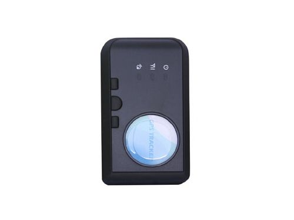

# Carscop - CCTR-622

The Carscop CCTR-622 is a compact personal GPS tracker designed for keeping track of children, pets, and valuable items. It provides real time location updates that can be viewed on a map, and it supports SMS location messages as a fallback. The device includes practical safety features such as SOS alerts, over range notifications, and over speed alerts, and it reports location with typical accuracy in the 10–20 meter range.

Because the CCTR-622 supports commonly used location reporting methods and map display, it can be used with Plaspy to bring those location updates into a centralized monitoring platform. Plaspy can surface the device's position on a map, consolidate alerts, and include the CCTR-622 in unified tracking and reporting views alongside other compatible devices, making it a suitable option for personal tracking needs managed through Plaspy.

## Key Highlights

- Compact form factor suited for personal carry or attachment
- Real time location reporting with Google Maps display capability
- SMS location messages provide a text based fallback channel
- Safety alerts including SOS, over range, and over speed notifications
- Typical location accuracy of about 10 to 20 meters
- Multi day battery endurance suitable for extended personal use
- Works over common mobile networks for broad coverage

## How It Works with Plaspy

The CCTR-622 can feed its location and alert information into Plaspy so that location data, safety notifications, and basic historical tracking are available from a single platform. Plaspy can aggregate updates from this device alongside other fleet and personal trackers to support monitoring and reporting needs.

- Display current position on Plaspy maps for quick situational awareness
- Record and review recent location history for route and movement checks
- Receive SOS and alert notifications through Plaspy alerting channels
- Use location updates to generate reports and simple activity summaries
- Combine CCTR-622 data with other devices in Plaspy for consolidated oversight

## Typical Use Cases

- Keeping track of young children during outings or travel
- Locating and monitoring pets when away from home
- Securing and tracking valuable personal items in transit
- Monitoring elderly family members for safety and location awareness
- Simple personal tracking deployments where ease of use is a priority

## Why Choose This Tracker with Plaspy

The CCTR-622 is aimed at personal tracking scenarios where compact size, straightforward map display, and basic safety alerts are the primary requirements. When paired with Plaspy, the device's location updates and alerts become part of a broader monitoring and reporting environment, making it easier to manage multiple devices and maintain historical records.

While the CCTR-622 is well suited for individual and small scale tracking tasks, Plaspy helps extend its value by centralizing visibility and notifications alongside other assets. If you need a simple, user friendly tracker for people, pets, or small items and want to view those locations within a unified platform, the CCTR-622 is a practical option to consider.

To learn more about how Plaspy can work with personal and small fleet trackers, visit https://www.plaspy.com. Product specifications, availability, and manufacturer details can change over time, so please verify current technical information on the official Carscop site http://www.carscop.com/.
