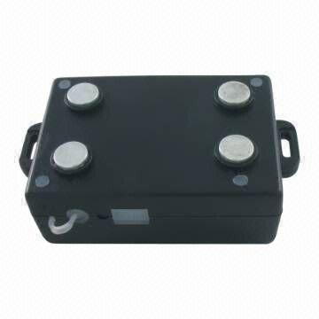

# Carscop - CCTR-700

The Carscop CCTR-700 is a versatile GPS tracker that offers reliable and accurate location tracking. It works by locating with GPS signals and sending back the information via SMS or GPRS. With support for four frequency channels \(850, 900, 1800, 1900 Mhz\), this tracker ensures wide coverage and compatibility with various networks.

One of the standout features of the CCTR-700 is its ability to send back the longitude and latitude of the current location by SMS or trigger a website map link to be sent. This allows users to easily track and monitor the location of their vehicles, elders, children, pets, rental cars, company vehicles, and more. The smart phone compatibility enables users to click on the website map link and view the location on their mobile devices.

With a built-in memory that can record the history track of up to 32768 points, the CCTR-700 ensures that no location data is lost. It can even record tracks without a GSM network, making it reliable in areas with poor network coverage. The shock sensor feature not only helps conserve battery life by controlling GPS on/off but also serves as a car shock and move alarm. Additionally, the tracker can be easily attached to any metal surface with its magnet point, making it discreet and hidden from the driver's view.

Overall, the Carscop CCTR-700 is a user-friendly and feature-rich GPS tracker that offers accurate location tracking, history recording, and various alarm functionalities. It is suitable for a wide range of applications, including personal and commercial use.

#### Key Features:

- GPS and GSM band support for wide coverage
- SMS and GPRS communication for location tracking
- Built-in memory for recording history track
- Shock sensor for battery conservation and car alarm
- Smartphone compatibility for easy tracking
- IP56 waterproof level for durability
- Rechargeable battery with long battery life
- Easy installation with embedded antennas
- Multiple alarm functionalities for added security

