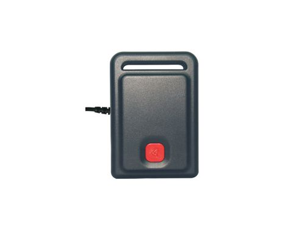

# Carscop - CCTR-802

The Carscop CCTR-802 GPS tracker is a powerful and covert tracking device designed for monitoring and securing vehicles. With its secret tab on the magnet, this tracker allows for discreet and covert tracking of transport. It features real-time GSM/GPS tracking in a waterproof housing, making it suitable for use in various weather conditions. The device is equipped with a maintenance-free battery charger, ensuring long-lasting performance without the need for frequent recharging. Additionally, the Carscop CCTR-802 comes with free web monitoring service provided by Carscop, allowing users to easily track and monitor their vehicles.

One of the standout features of the Carscop CCTR-802 GPS tracker is its real-time upload of the current location to a website, providing users with up-to-date information about the whereabouts of their vehicles. The tracker utilizes GPS technology to accurately locate the vehicle and uploads the data via GPRS. It also features a built-in memory to record tracks without a GSM network, ensuring that no data is lost even in areas with poor network coverage. The device is equipped with a shock sensor that controls the GPS function, helping to conserve battery life and also serving as a car shock and move alarm.

The Carscop CCTR-802 GPS tracker offers a range of useful features, including the ability to preset three phone numbers for SMS alerts, send SOS or alarm information to preset phones, and send alerts for over-range and over-speed situations. It also has a built-in backup rechargeable polymer battery with a battery life of 1-7 days, ensuring continuous operation even in the absence of a power source. With its magnet pin, the tracker can be easily attached to any metal surface on the car body, providing flexibility and convenience in installation. The device is IP56 waterproof, making it suitable for use in various environments. Overall, the Carscop CCTR-802 GPS tracker is an excellent choice for covert tracking of vehicles, making it ideal for use in cars, buses, taxis, rental cars, and other moving equipment.

### Key Features:

- Real-time upload of current location to website
- No platform service charge \(free tracking platform\)
- Waterproof and magnet pin for easy installation
- Large capacity rechargeable battery with long standby time
- Shock sensor for battery life optimization and car alarm functionality
- Preset phone numbers for SMS alerts
- SOS and alarm information sending
- Over-range and over-speed alerts
- Built-in backup rechargeable polymer battery
- Can be connected to car battery for continuous power
- Easy to hide and suitable for tracking various vehicles and equipment

### Package Contents:

- 1 Tracker
- 1 Car recharge adapter
- 1 USB wire
- 1 Manual

### Specifications:

- Main Dimension: 69mm\*48mm\*26mm
- Main Weight: 130g
- Package: Color box
- Package Dimension: 130mm\*200mm\*46mm
- Package Weight: 0.38kg

