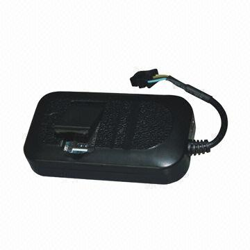

# Carscop - CCTR-803

The Carscop CCTR-803 is a versatile and reliable GPS tracker designed for vehicles, trucks, and cars. With its advanced features and user-friendly interface, it provides real-time tracking and monitoring capabilities to ensure the safety and security of your vehicles. 

One of the standout features of the CCTR-803 is its built-in antenna, which allows for easy installation and hidden placement. This ensures that the tracker remains discreet and does not interfere with the vehicle's aesthetics. Additionally, it comes with an external microphone that enables you to hear voice conversations inside the car, providing an extra layer of security and surveillance.

The CCTR-803 also offers online software GPRS air upgrade, allowing you to easily update the tracker's software remotely. It supports auto download and configuration of APN and GPRS settings, which can also be set via SMS. Moreover, it has the capability to check the balance of the tracker's SIM card through SMS, ensuring that you are always aware of the available credit.

In terms of tracking capabilities, the CCTR-803 utilizes both GPS and LBS \(GSM network base station\) technology for accurate and reliable positioning. It features a built-in 4 Band GSM and u-Blox GPS module, with A-GPS functionality for fast locating. The device can be located either by SMS or by calling it directly, without the need for a server. It also has the ability to report the location by SMS with a Google map link or with a text description, providing you with multiple options for tracking and monitoring.

The CCTR-803 offers a range of alarm features, including SMS alarms and SOS alerts. It can send alarm information to preset phone numbers and also to the tracking platform. Additionally, it supports move and shock alarms, which can replace the need for a separate car alarm system. The tracker is equipped with a built-in rechargeable Li battery for backup and power down alarm, ensuring continuous operation even in the event of a power failure.

With its comprehensive features and reliable performance, the Carscop CCTR-803 is an ideal choice for tracking and monitoring various types of vehicles, including cars, trucks, taxis, and buses. Whether you are a fleet manager, a rental car company, or simply want to keep an eye on your personal vehicle, the CCTR-803 provides the necessary tools for efficient and effective tracking.

### Key Features:

- Built-in antenna for easy installation & hidden placement
- External microphone for hearing voice in the car
- Online software GPRS air upgrade
- Auto download & configure APN & GPRS, Also can be set by SMS
- Tracker SIM card money balance SMS checking
- LBS locate \(GSM network base station locate\) without GPS
- Life time no platform Service charge \(Our free tracking platform\)
- Built-in 4 Band GSM & u-Blox GPS module
- U-Blox GPS module with A-GPS for fast locating
- Device can be located by SMS or calling without server
- Report location by SMS with Google map link without server
- Report location by SMS with text description without server
- 4 level user role for dealer / distributor / fleet management / Single user
- Alarm can be sent by SMS
- SMS report can be disabled to save charge
- Built-in rechargeable Li battery for backup & power down alarm
- Built-in memory to record track without GSM network
- Upload interval is 30 seconds & can be set by user SMS
- Stop uploading after the tracker stops moving for 2 minutes
- Uploading tracking is controlled by shock sensor
- Uploading tracking can be controlled by ON signal
- Report the last position when the tracker enters a no GPS signal place
- Upload web or IP can be set by SMS
- Tracker status can be checked by SMS
- Can freeze car running on the platform \(Remote turn off engine\)
- Can preset 3 phone numbers by SMS
- Can send SOS or alarm information to preset phone
- SOS & alarm information can also be sent to the platform
- Move alarm and shock alarm can replace car alarm function
- Open GPRS protocol to client for adding protocol to platform
- GPRS protocol can be changed to work with client platform
- Visit website can track the car or display the history tracking
- Platform supports iPhone & Android App locate / WeChat locate / SMS locate
- History tracking can be saved on the server for over 6-12 months
- Suitable for tracking cars, buses, trucks, taxis, rental cars, school buses, transportation vehicles, moving equipment, etc.

