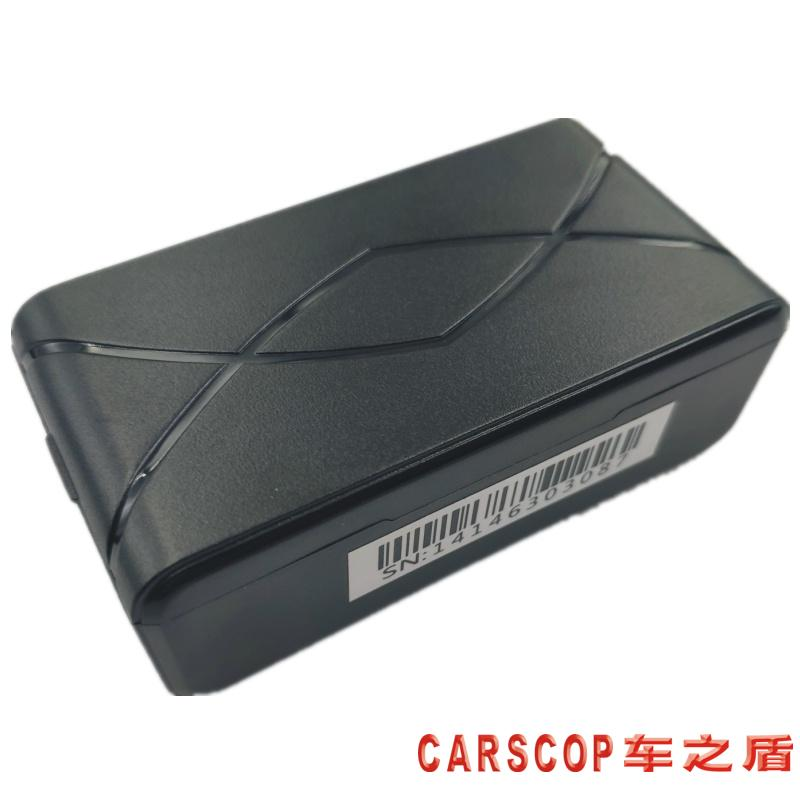

# Carscop - CCTR-824

The CCTR-824 is a compact, battery-powered long-life GPS tracker built for covert vehicle, equipment and rental asset tracking. Designed for quick DIY deployment, the unit requires no permanent wiring and mounts securely with strong magnetic pins or an optional magnet cover. As a Plaspy compatible tracker, the CCTR-824 delivers dependable location data to Plaspy’s platform via GPRS for easy real-time tracking, history playback, and alerting without complex installation.

Optimized for minimal power draw and long unattended operation, the CCTR-824 is ideal when you need months or years of monitoring on a single battery pack. It combines a low-detect deep-sleep mode, configurable locate intervals via SMS, and a light-based removal/fall alarm to support anti-theft workflows and telemetry-driven fleet management on Plaspy’s web and mobile apps.

## Key Highlights

- Plaspy compatible — uploads location and telemetry to a web server or IP address for instant viewing on PC and iPhone/Android apps.
- Ultra-long battery life — high-capacity 4500 mAh CR123A x3 pack gives up to 3 years of operation at one daily report.
- Covert, DIY installation — compact, magnet-mounted design avoids permanent installation and is easy to conceal on vehicles and equipment.
- Low-power anti-detection sleep mode — standby current &lt;2 μA conserves energy and reduces the chance of discovery.
- Light sensor for tamper/removal alerts — configurable fall/removal alarms help prevent theft or unauthorized movement.
- Fast and reliable GNSS fixes — 32-channel GPS with A-GPS support for quicker hot starts and accurate positioning \(typical 5–20 m\).
- Simple remote configuration — APN and GPRS auto-download plus SMS command configuration for flexible field setup.

## How It Works with Plaspy

Integrating the CCTR-824 with Plaspy is straightforward: the tracker sends GPRS packets to the server address you set by SMS or uses the manufacturer's HK platform \(lifetime free service\). Plaspy ingests location and device telemetry so you can monitor assets in real time, receive removal/tamper alerts, and view historical tracks through web and mobile dashboards.

- Real-time location and telemetry updates via quad-band GSM GPRS.
- Light-sensor-based removal/fall alarms forwarded to Plaspy for anti-theft alerting.
- Configurable reporting intervals — balance battery life and tracking granularity through SMS settings or Plaspy scheduling.
- Remote device configuration and APN/GPRS auto-download simplify deployments at scale.
- History tracking stored on the provider’s server \(typically 3–6 months\) and viewable in Plaspy for audit and route analysis.

## Technical Overview

| Model | CCTR-824 |
| --- | --- |
| Connectivity | Quad-band GSM/GPRS \(850/900/1800/1900 MHz\) |
| Bands | 850 / 900 / 1800 / 1900 MHz \(universal quad-band\) |
| Power & Battery | High-capacity Li pack, CR123A ×3 \(4500 mAh equivalent\); non-rechargeable; up to 3 years at 1 report/day |
| Power Consumption | Standby &lt;2 μA; locating current &lt;100 mA |
| Interfaces & Sensors | Embedded light sensor for fall/removal alarm; SMS-configurable auto ON/OFF and locate intervals; magnet-mounted housing |
| GNSS | 32-channel GPS receiver with A-GPS; typical accuracy 5–20 m; hot start ≈1 s; cold start ≈36 s |
| Antenna | Embedded GSM and GPS antennas |
| Remote Management | Auto APN/GPRS configuration, SMS commands for setup; upload to web server/IP; viewable on PC and iPhone/Android apps; lifetime free HK platform with history storage \(typically 3–6 months\) |
| Environmental | Operating: -20°C to +55°C; restricted operation/storage ranges to -35°C/+70°C and storage -40°C/+80°C |
| Form Factor | Compact, battery-powered covert tracker for vehicle/asset mounting; magnet cover optional |
| Package Contents | Main unit, three CR123A batteries, optional strong magnet cover, user manual |
| Bluetooth | Not included |
| Ignition / Immobilizer / Fuel Monitoring | Not applicable — this model is a stand-alone battery asset tracker. Can be used alongside Plaspy workflows that include separate devices providing ignition, immobilizer or fuel telemetry. |

## Use Cases

- Covert vehicle tracking and recovery — hide on rental cars, company vehicles, or high-risk assets for anti-theft monitoring.
- Equipment and construction asset monitoring — long-life tracking of machinery and tools left on sites without permanent wiring.
- Rental asset management — track trailers, bikes, or seasonal rentals with minimal installation and long battery intervals.
- Transit and stationary asset surveillance — monitor containers, parked equipment, or remote assets where mains power is unavailable.
- Temporary deployments for audits and inspections — deploy quickly, collect multi-week/month data, then recover the unit without vehicle modification.

## Why Choose This Tracker with Plaspy

The CCTR-824 is a practical choice when you need Plaspy compatible GPS tracking that emphasizes low maintenance, concealment and long unattended operation. Its standout benefits — multi-year battery life at low reporting rates, ultra-low sleep current, magnet-mounted design and light-sensor tamper alerts — reduce operating cost and simplify deployment across fleets and assets. Integration options \(GPRS upload to a server or Plaspy\) and SMS-based configuration let operations teams scale rollout without complex wiring or frequent battery swaps.

While this device does not include built-in ignition, immobilizer or Bluetooth sensors, it complements Plaspy’s broader telemetry ecosystem. Use the CCTR-824 for location and tamper-aware tracking and combine its data with other Plaspy-compatible sensors or vehicle-installed interfaces when you require detailed fuel monitoring, ignition-based events or BLE sensor data. For fleet management, anti-theft workflows and long-term asset monitoring, the CCTR-824 provides a low-cost, low-touch foundation that feeds trusted location and history into Plaspy’s platform.

