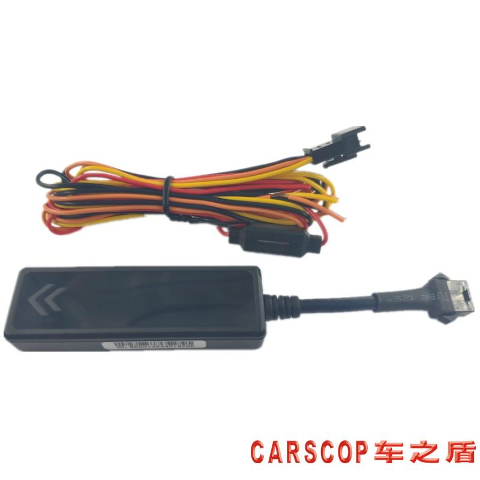

# Carscop - CCTR-825

The CCTR-825 is an extra-slim, compact 2G GPS tracker engineered for discreet vehicle installation and reliable Plaspy compatible tracking. Built around a high-sensitivity GSM and GPS module with a rechargeable backup battery, the CCTR-825 delivers continuous location reporting, tamper and power-down alarms, and open GPRS protocol support so fleet operators and integrators can connect the device to the Plaspy platform for real-time tracking and telemetry.

Designed for cars, trucks, motorcycles and a wide range of mobile assets, the CCTR-825 combines covert form factor and practical fleet functionality — wide 9–40V input range for versatile vehicle power, immediate motion-triggered uploads, configurable APN/server settings by SMS, and compatibility with iPhone/Android apps and the manufacturer’s web platform \(demo: www.999gps.net\). This makes the CCTR-825 an effective Plaspy compatible option for anti-theft monitoring, fleet management and long-term vehicle telemetry.

## Key Highlights

- Plaspy compatible for real-time tracking and centralized fleet management via open GPRS protocol.
- Extra-slim, discreet design \(75 × 25 × 13 mm\) suited to hidden installation in passenger and commercial vehicles.
- High-sensitivity GSM & GPS module and antennas for reliable positioning and easier concealed placement.
- Built-in rechargeable backup battery with power-down and removal alarm for anti-theft protection.
- Remote engine cut / immobilizer capability \(requires additional external cut relay\) to assist vehicle recovery and security.
- Movement detection with immediate upload and intelligent upload logic to conserve battery when stationary.
- Configurable by SMS \(APN, server IP\) and compatible with mobile apps plus free lifetime web tracking platform.
- Multi-level user management and open protocol simplify integration for distributors, fleet operators and third-party platforms.

## How It Works with Plaspy

When integrated with Plaspy, the CCTR-825 streams location and device telemetry over GPRS/GSM so fleet managers receive near real-time position updates, alarms and historical tracks. The device’s open GPRS protocol enables Plaspy to ingest the tracker’s data feed directly, while SMS configuration and server IP settings make initial setup and emergency updates straightforward without physical access.

- Real-time location and telemetry uploads via GPRS \(2G\) to the configured server \(Plaspy ingestible format via open protocol\).
- Motion detection with immediate upload on movement and intelligent upload suspension after 2 minutes of inactivity to conserve battery.
- Power-down and removal alarms reported to Plaspy for anti-theft alerts and tamper detection.
- Remote immobilizer / engine-cut support \(requires an external cut relay\) to enable vehicle shutdown commands from Plaspy when needed.
- Over-speed and geo-fence alarms configurable on the platform and delivered to operators through Plaspy alerting channels.

## Technical Overview

| Model | CCTR-825 |
| --- | --- |
| Connectivity | GPRS over GSM \(2G\) |
| Bands | Specific frequency bands not specified in documentation |
| Power & Battery | Operating voltage 9–40V; built-in rechargeable backup battery; supports power-down/removal alarm |
| Interfaces | Wired connections included; remote engine cut supported \(external cut relay required\); movement detection and tamper/power-loss alerts |
| GNSS | GPS positioning with high-sensitivity GPS module and built-in GPS antenna |
| Bluetooth | Not specified |
| Remote Management | Configurable by SMS \(APN, server IP\); compatible with iPhone/Android apps; manufacturer web platform \(www.999gps.net demo\); open GPRS protocol for third-party integration; multi-level user management and custom login/domain option |
| Form Factor | Compact/slim module 75 × 25 × 13 mm, 25 g \(main unit\); full packed set ~95 g, box 145 × 75 × 50 mm |

## Use Cases

- Fleet management — real-time tracking, route history retention \(3–6 months on platform\) and over-speed/geo-fence alerts for operational control.
- Car rental and car-sharing — discreet installation with tamper and power-down alarms to protect high-turnover assets.
- Anti-theft and recovery — immediate movement alerts, removal detection and remote engine cut option to assist recovery efforts.
- Long-term monitoring of trucks, buses and taxis — wide 9–40V input supports commercial vehicle installations and continuous telemetry reporting.
- Light asset tracking \(motorcycles, boats\) where compact form factor and covert mounting are required.

## Why Choose This Tracker with Plaspy

The CCTR-825 is a practical Plaspy compatible GPS tracker when you need discreet, dependable vehicle monitoring combined with flexible integration options. Its slim form factor and high-sensitivity GSM/GPS hardware make hidden installs reliable, while the built-in backup battery and tamper alarms provide essential anti-theft protections. For fleet operators, the unit’s wide voltage tolerance, open GPRS protocol, and support for remote engine cut \(via relay\) deliver the core building blocks for real-time tracking, telemetry and immobilization workflows within Plaspy.

Because the CCTR-825 supports SMS-based configuration, mobile apps and a manufacturer web platform with multi-level user controls, it is easy to deploy across distributed fleets and to integrate into Plaspy’s centralized dashboard. The open protocol and demo platform also simplify testing and third-party integration — enabling rapid onboarding for fleets that require real-time tracking, telemetry and secure fleet management without sacrificing covert installation or tamper detection.

