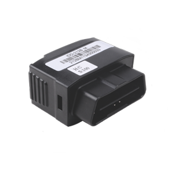

# Castel - IDD-212B

The Castel IDD-212B is a high-quality Bluetooth 4.0 Car OBD Scanner that is MFI certified and compatible with both iPhone and Android devices. This scanner is designed to communicate with your car's ECU \(Engine Control Unit\) to read various car running parameters such as speed, RPM, temperature, and error codes. It also has the capability to track fuel consumption and mileage, providing you with valuable insights into your vehicle's performance.

One of the standout features of the IDD-212B is its built-in flash memory, which allows for two months of data storage. This means that you can easily access and analyze your car's data at any time, even if you don't have your smartphone or tablet connected. The scanner is also equipped with a G-sensor, which can detect and record any sudden movements or impacts, providing you with additional security and peace of mind.

The IDD-212B operates on a wide voltage range of DC 9-16V and has low power consumption, making it suitable for use in various vehicles. It has a durable construction with an IP30 protection class, ensuring its reliability and longevity. With its Bluetooth 4.0 technology, you can seamlessly connect the scanner to your Android, WinCE, or iOS device and access real-time data and diagnostics through compatible apps.

### Key Features:

- Bluetooth 4.0 support for iPhone and Android
- Built-in flash for two months of data storage
- Car engine data reading, including RPM, speed, temperature, and DTCs
- Fuel consumption and mileage reading
- G-sensor for detecting and recording sudden movements or impacts

### Technical Specifications:

- Operating voltage: DC 9-16V
- Normal current: \<70 mA @ 13.8V
- Sleep current: \<20mA @ 12.0V
- Working temperature: -30℃ to +70℃
- Storage temperature: -40℃ to +85℃
- Relative humidity: 5% to 95% \(non-condensing\)
- Protection class: IP30
- Bluetooth data ratio: 2.1Mbps
- Bluetooth frequency: 2.4-2.48GHz
- Bluetooth specification: V2.1, class II
- Bluetooth module: GFSK; PI/4-DQPSK; 8DPSK
- Bluetooth sensitivity: -85dBm @ 0.1% BER

