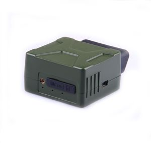

# Castel - IDD-213E

The Castel IDD-213E is an intelligent on board diagnostic and all in one device built for passenger and commercial vehicles. It combines GPS location tracking with the ability to read vehicle diagnostic information from the ECU, and forwards that data to a backend server for remote monitoring. Designed as a plug and play solution, the IDD-213E emphasizes ease of use while supporting common vehicle standards to reach a broad set of vehicle types.

As a Plaspy compatible device, the IDD-213E brings combined location and diagnostic data into a centralized fleet platform. Its support for vehicle diagnostic standards and cellular data transmission makes it well suited to feed Plaspy with realtime tracking, diagnostic trouble codes, and operational metrics so fleet managers can monitor vehicle health and behavior alongside location.

## Key Highlights

- Integrated GPS tracking and vehicle diagnostics in a single on board unit
- Plug and play design for straightforward deployment in passenger and commercial vehicles
- Support for OBD II EOBD J1939 and J1708 standards for wide vehicle compatibility
- 3G cellular connectivity for steady data transmission to a backend server
- Reads vehicle parameters such as speed RPM ECT and diagnostic trouble codes
- Provides mileage and fuel consumption statistics useful for fleet reporting
- SMS alarm capability for immediate phone alerts on selected events

## How It Works with Plaspy

When connected to Plaspy, the IDD-213E supplies both positional and diagnostic data to the platform so teams can combine location intelligence with vehicle health information. Plaspy ingests the device telemetry and makes it available for monitoring, alerts, and operational reporting.

- Real time location updates and route history for each tracked vehicle
- Centralized visibility of diagnostic trouble codes and freeze frame data inside Plaspy
- Reports on mileage and fuel consumption to support operational and cost analysis
- Driver behavior monitoring such as speeding hard acceleration deceleration and extended idle time reflected in Plaspy dashboards
- Alerts and SMS alarm events forwarded into Plaspy so teams can respond to incidents quickly
- Integration via device server settings using domain or IP forwarding to connect device data with Plaspy

## Typical Use Cases

- Fleet management for small and large commercial operators seeking location and health monitoring
- Car rental operations that require vehicle usage tracking and diagnostic alerts
- Vehicle insurance programs that need access to driving behavior and mileage statistics
- Driving schools and training fleets monitoring driver performance and vehicle condition
- Car service shops and maintenance operations that use diagnostic data to plan repairs and inspections

## Why Choose This Tracker with Plaspy

The IDD-213E is a practical choice when both vehicle diagnostics and location tracking are required from a single device. Its support for widely used diagnostic standards and industrial grade components make it appropriate for mixed fleets where compatibility and durability matter. Pairing the device with Plaspy allows organizations to consolidate location, vehicle health, and driver behavior into one operational view.

For teams that value combined telematics and diagnostic insight, the Castel IDD-213E can deliver the core data streams Plaspy needs to produce useful monitoring, alerts, and reporting. Its plug and play approach helps reduce deployment time while the device features target common fleet use cases.

To learn more about Plaspy and how compatible trackers like the Castel IDD-213E can fit into your fleet program visit https://www.plaspy.com. Product specifications availability and manufacturer details can change over time so please verify current specifications with the manufacturer documentation at http://www.castelecom.com/
