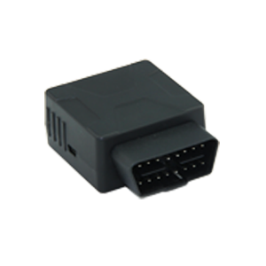

# Castel - IDD-213GL

The Castel IDD-213GL is an intelligent on board diagnostic device designed for both passenger and commercial vehicles. Its plug and play form factor reads diagnostic information from the vehicle ECU and captures location data for real time remote diagnostic and tracking purposes. The device is described as compatible with OBD II EOBD, J1939, and J1708 vehicle standards, and collects a combination of vehicle status, mileage, and driving behavior data while operating in a compact industrial enclosure.

As a Plaspy compatible device, the IDD-213GL can feed vehicle and diagnostic data into the Plaspy platform to support centralized fleet monitoring and reporting. The combination of location tracking and diagnostic readouts makes the unit useful where operators need both operational visibility and basic vehicle health metrics. Plaspy can consume the delivered data to display location, support alerts, and consolidate historical reporting for fleet oversight.

## Key Highlights

- Plug and play on board diagnostic device for passenger and commercial vehicles
- Compatible with OBD II EOBD, J1939, and J1708 vehicle standards for broad vehicle coverage
- Collects diagnostic data including vehicle speed, RPM, ECT, and diagnostic trouble codes
- Tracks driving behavior such as speeding, hard acceleration and deceleration, and idle engine
- Provides mileage and fuel consumption statistics useful for fleet efficiency analysis
- Compact industrial design with internal backup battery for unplug notification
- Designed for real time tracking and backend reporting by time interval distance and heading change

## How It Works with Plaspy

When used with Plaspy, the IDD-213GL supplies location and diagnostic streams that Plaspy presents as consolidated vehicle views, alerts, and reports. Plaspy ingests the device output to give operators timely situational awareness and historical analysis.

- View live vehicle location on Plaspy maps alongside diagnostic status updates
- Surface diagnostic trouble codes and basic ECU readouts in Plaspy reports
- Generate driver behavior alerts for speeding, harsh acceleration or braking, and excessive idling
- Produce mileage and fuel consumption summaries for operational cost tracking
- Configure notifications for unplug or ignition on off events to maintain device oversight
- Use historical data for route analysis and periodic operational reporting

## Typical Use Cases

- Fleet management for light and heavy vehicles needing combined tracking and diagnostics
- Service shops and car dealers monitoring vehicle health and usage history
- Insurance programs that analyze driving behavior and mileage trends
- Rental and leasing operations tracking location and basic vehicle diagnostics
- Commercial operators looking to reduce fuel cost and improve driver safety

## Why Choose This Tracker with Plaspy

The IDD-213GL pairs diagnostic capability with GPS tracking in a compact plug and play form, making it a practical choice for organizations that want both location visibility and vehicle performance indicators. Its support for widely used vehicle standards helps ensure compatibility across mixed fleets, and the device design emphasizes durability and continuous reporting.

Using the IDD-213GL with Plaspy provides a single pane of glass for monitoring vehicle position, driver behavior, and key diagnostic signals. For teams focused on operational oversight, maintenance planning, and driver coaching, this combination brings data together in a way that supports practical decision making while keeping deployment straightforward.

To learn more about using the Castel IDD-213GL with Plaspy visit https://www.plaspy.com. Product specifications, availability, and manufacturer details can change over time so please verify current technical information on the official manufacturer site http://www.castelecom.com/.
