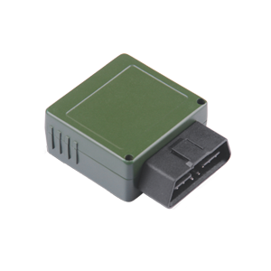

# Castel - IDD-213N

The Castel IDD-213N is an intelligent on-board diagnostic and all-in-one device designed for both passenger and commercial vehicles. With its plug-and-play technology, this device can easily read diagnostic information from the vehicle's ECU and capture location data, which is then sent to a backend server for real-time remote diagnostic and tracking purposes. This makes it an ideal solution for fleet management and vehicle tracking, car rental companies, vehicle insurance providers, driving schools, and car service shops.

One of the standout features of the IDD-213N is its support for 3G networks, specifically in the 800/850/1700/1900 MHz bands. This ensures reliable and fast communication between the device and the backend server. Additionally, the device is built with industrial-class components of high quality, ensuring durability and longevity.

With OBD II/EOBD, J1939, and J1708 compliance, the IDD-213N is compatible with a wide range of vehicles. It offers comprehensive data collection and analysis, including diagnostic data, location data, and driving behavior data. Users can access real-time tracking information and read diagnostic data such as vehicle speed, RPM, and ECT. The device also has the capability to read diagnostic trouble codes and freeze frame data, allowing for efficient troubleshooting and maintenance.

Other notable features of the IDD-213N include mileage and fuel consumption statistics, as well as driving behavior monitoring. This includes monitoring for speeding, hard acceleration/deceleration, and idle engine. In the event of an alarm, the device can send an SMS notification to the user's phone. The IDD-213N can easily connect to a backend server via domain or IP address, providing seamless integration into existing tracking and management systems.

