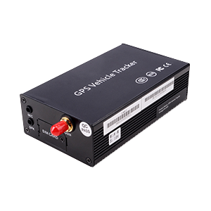

# Castel - MPIP-618-WA

The Castel MPIP-618W-A is a vehicle GPS tracker that combines location tracking with OBD diagnostic capabilities. Designed for passenger cars and business vehicles, it provides location visibility, vehicle diagnostics via a standard OBD interface, and a range of fleet oriented features such as mileage statistics, maintenance reminders, fuel consumption reporting, and stored data memory. The device is commonly used where both position tracking and basic vehicle health or usage data are valuable.

This model is compatible with Plaspy, making it a practical option for fleets and service operators that want to collect location and OBD-derived information inside a single monitoring platform. Plaspy can accept the MPIP-618W-A data feed to present real-time location, historical routes, alerts, and aggregated reports so teams gain operational oversight and can act on intelligent alarms from the device.

## Key Highlights

- Combined GPS tracking and OBD diagnostic data for location and vehicle usage insight
- High GPS and GSM sensitivity for consistent position reporting
- Quad-band GSM and GPRS connectivity for broad cellular coverage
- Configurable via over the air tools, SMS commands, or PC software for flexible management
- Intelligent alarm functions including SOS, ignition status, fatigue driving, and speeding alerts
- Fleet focused features such as mileage statistics, maintenance reminders, and fuel consumption tracking

## How It Works with Plaspy

When used with Plaspy, the MPIP-618W-A sends location and vehicle status information that Plaspy visualizes and organizes for fleet operators. Plaspy receives the device telemetry and exposes it through its monitoring and reporting tools so teams can track assets and respond to events.

- Real time location display and live tracking on Plaspy maps
- Event and alarm handling for SOS, speed, ignition, and other alerts to support rapid response
- Historical routes, mileage aggregation, and usage reports to aid operational analysis
- Consolidated fleet dashboards showing device status, recent activity, and key summaries
- Exportable reports and configurable notifications to support maintenance and compliance workflows

## Typical Use Cases

- Logistics and delivery fleets that need combined location and vehicle usage monitoring
- Engineering and service vehicles requiring scheduled maintenance reminders and mileage tracking
- Transport of hazardous materials where continuous oversight and alarms improve safety
- Taxi and rental fleets that benefit from both positioning and diagnostic information
- Public transportation and shuttle services looking for route history and operational reports

## Why Choose This Tracker with Plaspy

The MPIP-618W-A is a practical choice for organizations that need both positioning and OBD level vehicle data in one terminal. Its combination of fleet features and configurable alarm logic makes it suitable for mixed vehicle fleets where visibility and routine vehicle oversight are important. Paired with Plaspy, the tracker’s data can be organized into actionable dashboards and reports that support daily operations and longer term analysis.

Because the device is broadly suited to passenger cars and business vehicles and supports common connectivity and configuration methods, it integrates naturally into Plaspy environments where location tracking, alerting, and usage reporting are required. If your operations rely on consolidated monitoring and periodic diagnostic information, this model is a reasonable fit to evaluate.

To learn more about how Plaspy can work with the Castel MPIP-618-WA and other compatible devices, visit https://www.plaspy.com. Product specifications, availability, and manufacturer details can change over time, so please verify current specifications and certification directly with the manufacturer at http://www.castelecom.com/ before making procurement decisions.
