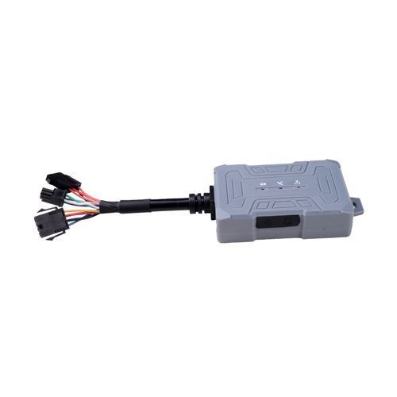

# Castel - MPIP-619

The Castel MPIP-619 is a compact hard wired GPS tracker designed for motorcycle and vehicle management. Built with IP54 dustproof and water resistant protection, the device is intended to withstand demanding road conditions while remaining lightweight and unobtrusive. It provides real time positioning and supports connection with external accessories to enable features such as remote engine cut off and remote configuration.

As a device compatible with Plaspy, the MPIP-619 can be integrated into fleet monitoring workflows to provide continuous location visibility and operational oversight. Its capabilities for SMS and GPRS based parameter setting, data storage in zero signal zones, and a range of vehicle focused alerts make it a practical option for organizations that want to add this hardware to Plaspy for tracking, alerts, and reporting.

## Key Highlights

- Compact and lightweight design suited for motorcycles and small vehicles with dimensions 75mm x 48mm x 20mm and weight around 70 g.
- IP54 rated enclosure for dust and water resistance, intended for use in outdoor and vehicle environments.
- Real time location tracking with positional accuracy reported under 15 m for routine monitoring.
- Supports remote functions such as engine cut off and remote parameter setting via SMS and GPRS, when paired with compatible accessories.
- Built in features for vehicle oversight including mileage statistics, vehicle diagnostic analysis, SOS and speeding alarms, and geo fencing.
- Local data storage to retain position reports when the device is in a no signal zone, with later upload when connectivity resumes.
- Broad operating range and standby power for continuous operation across typical vehicle voltages and environmental temperatures.

## How It Works with Plaspy

When connected to Plaspy, the MPIP-619 provides location and event data that Plaspy can present in maps, dashboards, and reports to support fleet management and operational decisions.

- Live and historical location visibility for each tracked vehicle in the Plaspy platform.
- Alerts and notifications in Plaspy for SOS triggers, speeding events, geo fence breaches, and other device alarms.
- Aggregated mileage and movement data shown in Plaspy reports to support utilization and route analysis.
- Offline data held by the device is synchronized to Plaspy once a connection is available, preserving continuity of tracking history.
- Remote command support via accessory channels can be managed and logged within Plaspy workflows where available.

## Typical Use Cases

- Motorcycle fleet tracking and oversight for delivery or courier operations.
- Small vehicle monitoring for rental fleets and staff transport.
- Asset security and theft deterrence using SOS and remote interrupt capabilities.
- Route and mileage monitoring for operational reporting and cost control.
- Remote sites or low coverage areas where local data storage preserves tracking continuity.

## Why Choose This Tracker with Plaspy

The Castel MPIP-619 is a practical option for organizations that need a compact, vehicle oriented tracker with a balanced set of location and remote control features. Its ruggedized IP54 design and lightweight form factor make it suitable for a variety of vehicle types, especially motorcycles and small fleet vehicles, while its ability to store data in low signal areas helps maintain continuity of records.

Paired with Plaspy, the MPIP-619 can contribute to a complete fleet management setup that emphasizes visibility, alerting, and basic vehicle oversight. If you are evaluating devices for integration, this tracker is worth considering for deployments where compact size, real time positioning, and remote configuration are priorities. To learn more about Plaspy and how compatible devices are used on the platform visit https://www.plaspy.com. Product specifications, availability, and manufacturer details can change over time, so please verify current technical details and support information on the official Castel site http://www.castelecom.com/.
