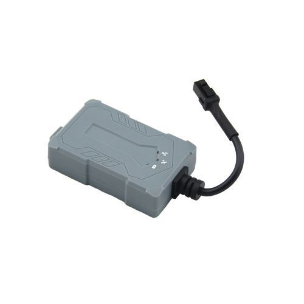

# Castel - MPIP-620

The Castel MPIP-620 is a compact GPS tracker designed specifically for motorcycles. It provides high precision positioning and communicates updates using GPRS and SMS. The device is tailored for motorcycle owners and small vehicle applications, offering position monitoring, motion detection, fortification and towing alarms, and route history. Its compact dimensions, IP54 rated plastic shell, and a dedicated mobile app called Lite Guardian for iOS and Android make it suitable for on-bike security and basic fleet oversight.

As a Plaspy compatible device, the MPIP-620 can feed location and event data into Plaspy's platform so fleet managers and individual owners can monitor activity and receive alerts in one place. The tracker's real time positioning, movement alerts, geo fencing capability, and history reporting complement Plaspy's dashboards, alerting, and reporting features, enabling motorcycle centric tracking within a broader fleet management workflow.

## Key Highlights

- Purpose built for motorcycles with a small form factor and light weight for discreet installation and minimal interference with vehicle operation.
- High precision GPS positioning with reported positional accuracy under 15 meters for reliable location updates.
- Communications via GPRS and SMS to transmit location and event data remotely to a monitoring platform.
- Onboard motion detection plus fortification and towing alarms to support theft prevention and rapid response.
- Mobile app support with Google Maps integration for on device monitoring and route viewing.
- Durable IP54 enclosure and wide operating temperature range for resilient performance in varied conditions.

## How It Works with Plaspy

The MPIP-620 can be integrated into Plaspy to provide continuous visibility of motorcycle location and status. Plaspy ingests the tracker data and presents it alongside other fleet assets so operators can manage vehicles consistently.

- Real time location display on Plaspy maps for live tracking of motorcycles and small vehicles.
- Historical route playback and trip history available in Plaspy for review and evidence of usage.
- Geo fencing and movement alerts from the device surfaced in Plaspy to notify teams of boundary events.
- Alarm and event forwarding to Plaspy so fortification, towing, overspeed, and low battery conditions appear as platform events.
- Mileage and activity reporting in Plaspy derived from device position updates to support operational analysis.

## Typical Use Cases

- Individual motorcycle owners who want continuous tracking and theft protection.
- Motorcycle courier and delivery services needing real time visibility of riders.
- Driving schools and training fleets monitoring student vehicle movement and route history.
- Tourism and rental motorcycle operators tracking vehicle usage and location.
- Small logistics operations that include two wheeled vehicles within broader fleet oversight.

## Why Choose This Tracker with Plaspy

The Castel MPIP-620 is a practical choice when motorcycle focused tracking is required alongside fleet management. Its compact design, motion detection, and user oriented app make it suitable for owners and small fleets that need straightforward positioning, alarms, and route history. When paired with Plaspy, the MPIP-620's location and event data can be consolidated into a single platform for monitoring, alerts, and reporting across mixed fleets.

If you are evaluating trackers for motorcycles or small vehicle fleets, the MPIP-620 offers a balance of device level security features and data that Plaspy can use to improve operational oversight. Learn more about Plaspy on the main website https://www.plaspy.com. Product specifications, availability, and manufacturer details can change over time, so verify current specifications on the official Castel website http://www.castelecom.com/.
