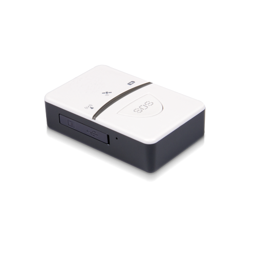

# Castel - PT-718

The Castel PT-718 is a compact portable personal GPS tracker designed for tracking people, vehicles, and pets. It combines GPS and A GPS positioning with GSM GPRS connectivity to provide timely location updates and supports features commonly needed for personal safety and lightweight asset tracking. The device emphasizes long standby time and low energy consumption while offering practical alarms such as SOS and geo fence alerts.

As a device that can communicate location via SMS or GPRS, the PT-718 is a natural fit for use with Plaspy for monitoring and management. Plaspy can ingest and visualize position reports from compatible trackers, enabling fleet managers and individual users to monitor movement, receive alerts, and generate operational insights from PT-718 devices alongside other equipment on the platform.

## Key Highlights

- Portable and lightweight design suitable for personal and pet use
- SOS alert function for emergency notifications
- Real time tracking and timing positioning for up to date location information
- GPS and A GPS dual position modes to improve reliability of fixes
- Geo fence alert to notify entry or exit from predefined areas
- Built in high capacity battery and low power consumption for extended standby

## How It Works with Plaspy

When used with Plaspy, the PT-718 provides location and alert data that the platform can present for operational oversight and incident response. Plaspy brings that data into a centralized view where tracking, historical playback, and alert handling are available alongside other devices.

- Centralized live location view for individual devices and groups
- Alerts mapping including SOS and geo fence notifications routed to platform users
- Historical route playback for reviewing movements over time
- Customizable reporting and export of location and event logs
- Device status and connectivity overview to support operational decisions

## Typical Use Cases

- Personal safety monitoring for children, seniors, and lone workers
- Pet tracking to locate and recover lost animals
- Light vehicle or scooter location tracking for small fleets
- Short term asset monitoring for equipment in transit
- Situational monitoring where compact, portable tracking is required

## Why Choose This Tracker with Plaspy

The PT-718 offers a compact form factor with core tracking and alarm features that align well with Plaspy use cases for personal safety and small scale fleet oversight. Its SOS function and geo fence alerts provide clear event types that Plaspy can surface to operators, while the device battery characteristics and low power behavior support longer deployment between charges.

If you are evaluating devices for integration into Plaspy, the PT-718 is a practical option when you need a lightweight, portable tracker that reports location and alerts over standard mobile data channels. To learn more about Plaspy and how the platform can manage PT-718 devices, visit https://www.plaspy.com. Product specifications and availability can change over time, so please verify current details with the manufacturer at http://www.castelecom.com/ before making procurement or deployment decisions.
