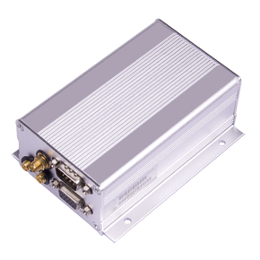

# Castel - SAT-802

The Castel SAT-802 is a cutting-edge GPS tracker that combines iridium SBD and GPRS technology to provide reliable and global tracking capabilities. Designed specifically for high-value asset tracking, this device ensures that there are no blind areas on the earth, offering fleet operators complete coverage and internet-based fleet monitoring.

One of the standout features of the SAT-802 is its dual-module functionality, utilizing both iridium and GSM communication channels. This allows for seamless and transparent two-way data transmission, ensuring that fleet operators can stay connected with their assets no matter where they are located. The device also intelligently chooses the communication channel, with GSM being the priority.

In terms of specifications, the SAT-802 operates within a wide voltage range of 9V to 36V DC, making it compatible with a variety of vehicles and assets. It utilizes GPS positioning for accurate tracking and has a maximum working current of less than 450mA at 13.8V, with a transient peak current of 2W. The device also features various power-saving modes to optimize battery life, with a standby working current of less than 145mA at 13.8V and a power-saving working current of less than 95mA at 13.8V.

With a working temperature range of -30℃ to +70℃ and a storage temperature range of -40℃ to +85℃, the SAT-802 is built to withstand harsh environmental conditions. It also has a protection degree of IP30, providing some resistance against dust and moisture. Whether you need to track vehicles, containers, or other valuable assets, the Castel SAT-802 is a reliable and versatile GPS tracker that offers global coverage and advanced tracking capabilities.

