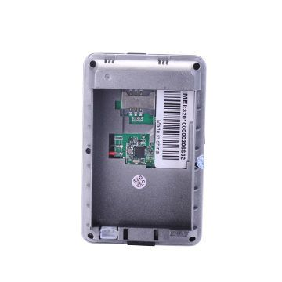

# Cityeasy - 007

The Cityeasy 007 is a car GPS tracker designed to provide reliable real time location and remote monitoring for vehicles. It combines LBS and GPS position reporting with long distance monitoring capability, a removable 5000mAh battery for extended operation, and an IP67 rated enclosure to resist water and dust. The device is positioned for both personal vehicle owners and commercial fleet operators who need continuous visibility of vehicle whereabouts.

As a Plaspy compatible device, the Cityeasy 007 can feed location and status information into the Plaspy platform to support fleet oversight and operational reporting. When paired with Plaspy, the tracker adds straightforward vehicle visibility, longer deployment windows thanks to its battery capacity, and a durable build suited to varied environments.

## Key Highlights

- LBS and GPS based real time position tracking for continuous location visibility
- Long distance remote monitoring for off site oversight
- Removable 5000mAh battery to reduce the need for frequent recharging
- IP67 waterproof rating for protection against water and dust exposure
- Built for both personal and commercial vehicle use with a durable design
- Well suited to extended trips and deployments where access to power is limited

## How It Works with Plaspy

When integrated with Plaspy, the Cityeasy 007 provides location and device status that Plaspy uses to present live and historical views of vehicle activity. Plaspy users can monitor fleets, review trips, and set operational rules that help turn raw tracker data into useful oversight.

- Live map view to see current vehicle locations and basic status
- Historical route playback and trip summaries for post trip review
- Alerts and notifications for movement and device offline conditions
- Fleet dashboards for consolidated monitoring of multiple vehicles
- Battery and basic device status surfaced in Plaspy for maintenance visibility

## Typical Use Cases

- Personal vehicle tracking for theft deterrence and location recovery
- Small to medium fleet monitoring for delivery and service operations
- Rental or shared vehicle oversight to monitor usage and location
- Long distance journeys and logistics where extended battery life is beneficial
- Deployments in outdoor or damp environments that require a waterproof tracker

## Why Choose This Tracker with Plaspy

The Cityeasy 007 is a practical option for organizations and individuals who need a straightforward vehicle tracker with dependable location reporting and a focus on endurance. Its sizable removable battery and waterproof construction make it a sensible choice when regular access to power is not guaranteed or when devices are exposed to varied conditions.

Paired with Plaspy, the tracker helps deliver clearer operational visibility and simpler fleet management workflows. Plaspy turns the device data into map views, reports, and alerts that assist with daily oversight and longer term analysis, making the Cityeasy 007 a useful component in a vehicle tracking solution.

To learn more about how Plaspy can work with compatible trackers and to explore platform features visit https://www.plaspy.com. Product specifications, availability, and manufacturer details can change over time, so verify current specifications on the manufacturer official website before making purchasing or deployment decisions.
