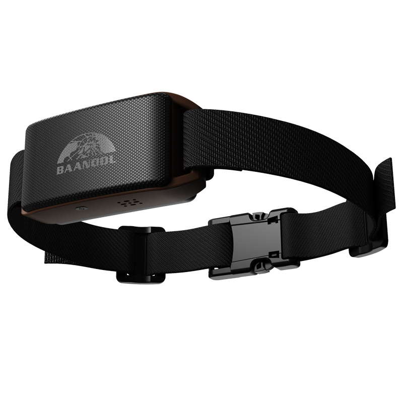

# Coban - BN-201

The BN-201 is a compact pet GPS tracker designed for dependable location monitoring, remote voice monitoring, and configurable geofence alerts. Built for everyday wear at 52 g, the BN-201 combines high-sensitivity GNSS positioning with dual-network connectivity to deliver low-power, real-time tracking intended for dogs, cats, and other companion animals.

As a Plaspy compatible device, the BN-201 can integrate with Plaspy's platform using standard reporting channels so owners and service providers can view live location, history, and event alerts from the same dashboard. Its voice broadcast and remote listening capabilities also extend Plaspy's situational awareness options for pet safety and emergency scenarios.

## Key Highlights

- Plaspy compatible pet tracker that reports position and status using common reporting channels for platform integration.
- Compact and lightweight design at 52 g suited for collar attachment and daily use.
- Dual-network connectivity and low-power design to support extended standby and frequent updates.
- High-sensitivity GNSS positioning with typical accuracy suitable for reliable pet location.
- Remote voice broadcast and listening features to assist with on-the-ground safety and behavioral scenarios.
- Configurable geofence support for departure and boundary alerts through Plaspy.

## How It Works with Plaspy

Integration is straightforward because the BN-201 uses reporting methods that Plaspy accepts; the device transmits position and event data which Plaspy decodes and displays for live tracking, history playback, and alerting. This allows pet owners and operators to manage location data alongside other assets in a single interface.

- Live location updates appear on Plaspy maps for continuous tracking and route history.
- Geofence alerts trigger notifications in Plaspy when a pet leaves or enters predefined areas.
- Voice monitoring and broadcast functions can be invoked through supported device commands and surfaced in Plaspy workflows for urgent use.
- Flexible reporting channels enable Plaspy to receive regular telemetry as well as fallback messages for robustness.
- Configurable alerts and reporting intervals allow teams to balance update frequency with battery life and operational needs.

## Typical Use Cases

- Real-time pet location tracking for dogs, cats, and other companion animals.
- Geofence monitoring to notify owners when a pet exits a safe area.
- Remote training and behavior management using voice cues sent through the device.
- Emergency monitoring to listen or broadcast messages from a pet's surroundings.
- Lightweight tracking of small assets where compact size and long standby are beneficial.

## Why Choose This Tracker with Plaspy

The BN-201 is a practical choice for Plaspy users focused on pet safety and straightforward remote monitoring. Its combination of compact design, reliable location reporting, and voice features makes it a fit for owners, pet services, and small operators who need clear visibility and configurable alerts within Plaspy’s interface.

If your deployment requires vehicle grade telemetry or specialized fleet sensors, other Plaspy compatible devices may better match those advanced needs. For pet-focused tracking, however, the BN-201 offers a balanced set of capabilities that integrate cleanly with Plaspy for live monitoring, geofence management, and simple remote voice interactions.

To learn more about Plaspy and compatible devices visit https://www.plaspy.com. Product specifications and availability can change over time so please verify current details with the manufacturer at https://www.coban.net/ before purchase.
