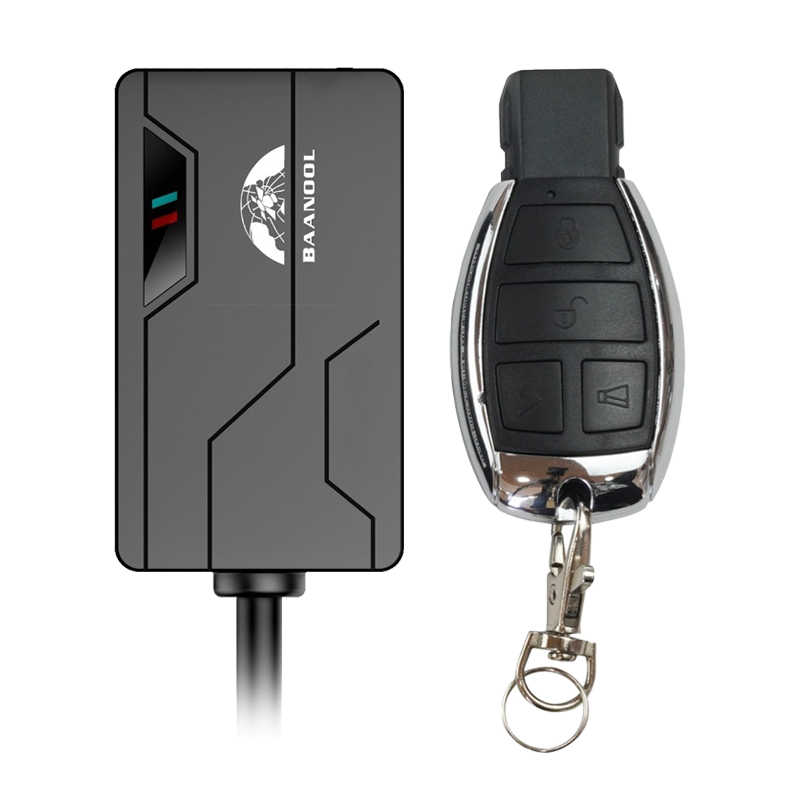

# Coban - BN-311C

The BN-311C is a compact 2G GPS tracker designed for motorcycle and small vehicle tracking. It is intended for concealed, hardwired installation and continuous connection to a 12–24 V electrical system while providing backup reporting when external power is lost. The device focuses on discreet anti-theft features and remote immobilization options appropriate for riders, owners, and light vehicle operators.

As a Plaspy compatible device, the BN-311C can feed GNSS position, alarm and telemetry data into Plaspy platforms for live monitoring and basic fleet management. Its focused feature set—real-time location, event alerts, and remote control capabilities—makes it a practical option to integrate into Plaspy workflows for security, operational oversight and simple route history review.

## Key Highlights

- Plaspy compatible device that sends position, alarms and telemetry for live tracking and reporting.
- Compact concealed form factor ideal for motorcycles and small vehicles, minimal visual footprint.
- Anti-theft alarms including movement, geo-fence breach, shock, illegal ignition and external power disconnection.
- C-type remote-control features such as remote arming/disarming and remote fuel or power cut-off for immobilization.
- GNSS positioning with typical meter-level accuracy and performance suited to routine tracking needs.
- Hardwired vehicle power with internal backup battery to maintain reporting during external power loss.
- Simple configuration and reporting options that facilitate integration with Plaspy monitoring and alerts.

## How It Works with Plaspy

Once installed and configured, the BN-311C delivers position fixes and status messages to Plaspy so the platform can present live maps, event notifications and historical routes. Plaspy ingests the device messages and exposes alarms and control actions through platform interfaces, allowing operators to monitor assets and respond to incidents.

- Real-time location updates and route playback visible within Plaspy dashboards and maps.
- Event and alarm reporting for movement, geo-fence breaches, shock, ignition anomalies and power loss surfaced as Plaspy alerts.
- Remote immobilizer and arm/disarm actions available through Plaspy workflows where supported by the device configuration.
- Telemetry and status messages used for fleet monitoring, utilization reporting and start/stop analysis.
- SOS and emergency alarm events transmitted to Plaspy for rapid attention and operator response.

## Typical Use Cases

- Motorcycle anti-theft protection with discreet installation and remote immobilization options.
- Small two-wheeler fleet tracking for delivery services requiring real-time visibility and route history.
- Rental or shared scooter and motorcycle operations that need concealed monitoring and quick alerting.
- Individual rider asset protection where compact hardware and straightforward remote control are priorities.

## Why Choose This Tracker with Plaspy

The BN-311C is suited to organizations and individuals looking for a compact, purpose-built tracker that pairs with Plaspy for core tracking and security workflows. Its small size and focused anti-theft functions make it a convenient choice when discreet installation and basic immobilization are required, and Plaspy provides the platform layer for live monitoring, alerting and simple fleet oversight.

If you want to explore how the BN-311C can fit into your tracking setup, learn more about Plaspy on the main website https://www.plaspy.com. Product specifications, availability and manufacturer details can change over time, so please verify current technical information on the manufacturer site https://www.coban.net/.
