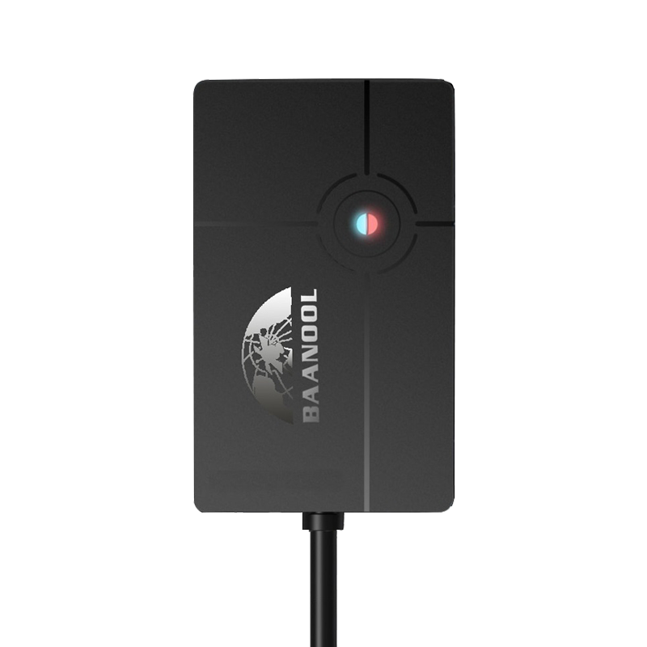

# Coban - BN-401C

The BN-401C is a compact GPS tracker from Coban designed for concealed installation on motorcycles and small vehicles. It provides continuous positioning, event reporting, and essential remote control features. The device includes an internal backup battery and an option for a relay wiring harness, enabling emergency alarms and remote fuel or power cutoff when integrated into a vehicle electrical system.

As a Plaspy compatible device, the BN-401C can deliver location, ignition state, and alarm events into Plaspy for live monitoring, alerts, and historical reporting. Its support for multiple cellular communication methods and its small form factor make it a practical option for fleet managers and individual owners who need discreet, reliable tracking and straightforward remote-control capabilities through the Plaspy platform.

## Key Highlights

- Plaspy compatible compact tracker suited for motorcycles and small vehicles for discreet installation.
- Multi network communication options including 2G and 4G plus SMS and TCP UDP messaging for resilient data delivery.
- Internal rechargeable backup battery to preserve emergency reporting and basic offline position uploads when external power is lost.
- Support for common alarms and remote controls such as geo fence, overspeed, SOS, movement or shock alerts, low battery and external power disconnect notifications.
- Optional relay and wiring harness for remote fuel or power cutoff to support immobilization workflows.
- Small form factor that simplifies concealed installations and reduces visibility to deter tampering.

## How It Works with Plaspy

When connected to Plaspy, the BN-401C sends position updates and event messages that Plaspy maps into dashboards, alerts, and reports for operational oversight. Plaspy ingests device messages and makes location and alarm information available across real time maps and historical playback, enabling centralized monitoring and response.

- Real time location updates and route playback for live fleet visibility.
- Ignition state and engine on off events forwarded to Plaspy for simple engine monitoring and status dashboards.
- Geo fence, overspeed, movement shock, SOS, and power alarms trigger configurable alerts and escalation rules in Plaspy.
- Remote fuel or power cutoff via the device relay can be reflected in Plaspy workflows for theft response and immobilization tracking.
- Low battery and external power disconnect notifications help administrators schedule maintenance or investigate tampering.

## Typical Use Cases

- Motorcycle fleet management for route monitoring, ignition events, and safety oversight.
- Individual motorcycle anti theft protection combining discreet installation with SOS and movement alerts.
- Scooter or shared vehicle operations needing compact trackers for location reporting and tamper detection.
- Small vehicle monitoring where a low profile tracker and basic remote control are sufficient for security and oversight.

## Why Choose This Tracker with Plaspy

The BN-401C pairs a small, concealed hardware profile with the core reporting and remote control features that many Plaspy users require. Its combination of continuous positioning, alarm reporting, and an included relay option makes it convenient for deployments focused on anti theft, basic fleet tracking, and rapid incident response. Because the device supports multiple communication methods, it can maintain connectivity across different cellular conditions and feed that information into Plaspy for consolidated monitoring.

For organizations and individuals managing motorcycles or compact vehicles, choosing the BN-401C with Plaspy offers a practical way to centralize location data, alarm events, and simple remote controls into one platform without adding installation complexity. To learn more about how Plaspy can work with compatible devices visit https://www.plaspy.com and for the most current product specifications and manufacturer documentation check https://www.coban.net/ as product details and availability can change over time.
