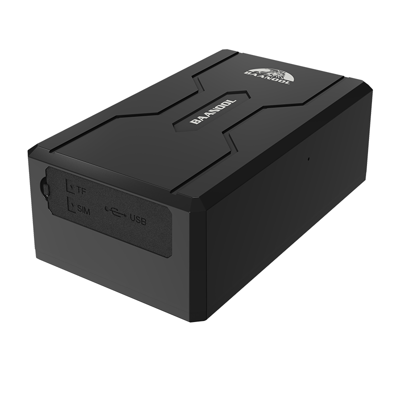

# Coban - BN-408A

The BN-408A is a portable GPS tracker from Coban designed for reliable asset management and anti theft protection. It features a strong magnetic mount for tool free placement on vehicles and movable assets, a high capacity 3.7V 10,000 mAh rechargeable battery for extended deployments, and onboard tamper detection to support security workflows. The device is intended for long term, maintenance light monitoring when permanent installation is not practical.

This model is fully compatible with Plaspy, allowing operators to integrate its real time location updates and alarm reports into Plaspy dashboards and workflows. Because the BN-408A supports common transport methods and remote configuration options, it can deliver live position, alarm events, and battery status into Plaspy for monitoring, playback, and operational response.

## Key Highlights

- Portable magnetic mount for quick, non invasive placement on vehicles trailers and other movable assets
- Long life 3.7V 10,000 mAh rechargeable battery for extended standby between charges
- Built in infrared tamper detection and multiple alarm types to support anti theft workflows
- Supports common transport methods so Plaspy can receive real time location and status updates
- Configurable power strategies including smart and power saving modes to balance reporting and battery life
- Real time tracking and track playback suitable for fleet monitoring and route auditing

## How It Works with Plaspy

When connected to Plaspy the BN-408A reports location and status so operators can view live positions, receive alarms, and review historical tracks. Plaspy ingests the device data and uses it to drive alerts, maps, and reporting for fleet or asset managers.

- Live location and telemetry in Plaspy for visibility into asset movement and status
- Tamper and movement alarms forwarded to Plaspy to trigger alerts and response workflows
- Geo fence alerts and track playback to validate routes and investigate incidents
- Power saving and Smart Mode reporting to extend deployment duration while preserving key updates
- Remote voice monitoring and alarm notifications to assist situational checks when needed
- Multiple transport options so Plaspy can accept data across standard telematics channels

## Typical Use Cases

- Temporary or seasonal fleet vehicles that need non invasive, Plaspy compatible tracking
- Trailer and container security where magnetic mounting and tamper detection reduce theft risk
- Portable high value equipment monitoring such as generators tools and leased assets
- Anti theft recovery workflows that rely on real time location and alarm escalation
- Extended remote monitoring deployments where battery life and low maintenance are priorities

## Why Choose This Tracker with Plaspy

The BN-408A pairs portability with long battery endurance and tamper aware security, making it a practical choice for operators who need flexible asset visibility without permanent wiring. Its reporting modes let teams trade off update frequency and battery life, while the magnetic mount reduces installation time and asset downtime.

Combined with Plaspy, the BN-408A provides clear operational value for organizations focused on fleet oversight, route auditing, and theft deterrence. Plaspy brings centralized dashboards alerts and playback that make the tracker data actionable across recovery and management workflows.

To learn more about how Plaspy can work with compatible trackers visit https://www.plaspy.com. Product specifications and availability can change over time so please verify current details on the manufacturer site https://www.coban.net/ before purchase.
