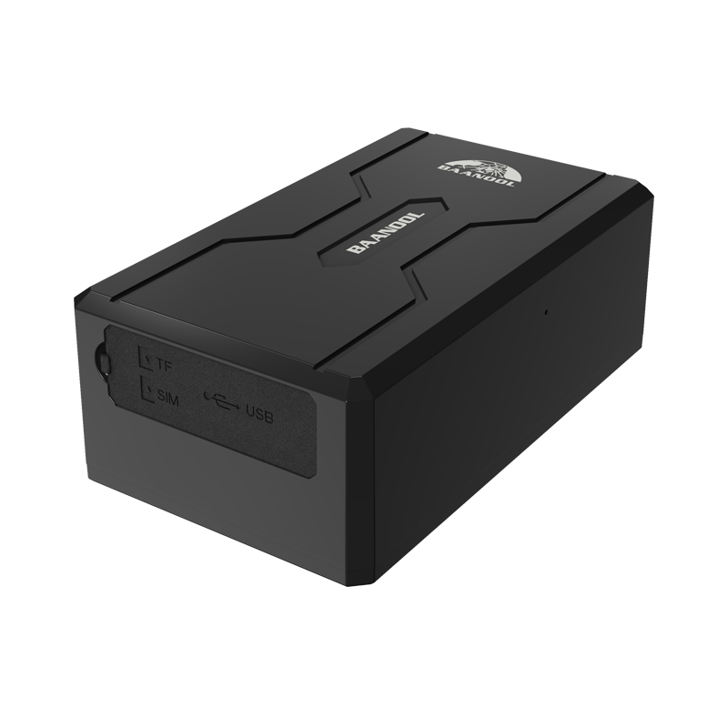

# Coban - BN-408B

\<meta itemprop="name" content="BN-408B">
  
The BN-408B is a portable wireless GPS tracker designed for discreet, long-life mobile asset management and anti-theft protection. Plaspy compatible out of the box, the BN-408B delivers reliable real-time tracking and rich alarm telemetry over 2G/3G/4G networks, making it ideal for fleet management, high-value asset security, and logistics use cases where extended standby and covert mounting matter.

Built for long-term deployments, the BN-408B combines strong magnetic adsorption for easy attachment to vehicle chassis or valuables with a very large 10,000 mAh rechargeable Li-ion battery for extended standby times. The unit reports location, movement and a comprehensive set of alarms to Plaspy using TCP, UDP or SMS, and Model B variants add SOS, external power disconnection alarm and remote immobilization for enhanced anti-theft control and emergency response.

## Key Highlights

- Plaspy compatible GPS tracker for real-time tracking and playback across 2G/3G/4G networks.
- Powerful 10,000 mAh rechargeable Li‑ion battery \(3.7V\) for long standby and low-maintenance operation.
- Strong magnetic adsorption lets you attach the device quickly and discreetly without permanent installation.
- Comprehensive alarm set: tamper \(infrared\), low battery, movement, shock, overspeed, blind area and geo-fence.
- Model B variant adds SOS alarm, external power disconnection alarm and remote immobilization capabilities.
- Remote voice monitoring for emergency listening and improved situational awareness.
- Flexible reporting via TCP/UDP/SMS and remote configuration for fleet-scale deployments and telemetry integration.

## How It Works with Plaspy

When paired with Plaspy, the BN-408B streams location and alarm data into your fleet management and asset-tracking dashboards for real-time visibility and historical playback. Plaspy receives position updates, alarms and status messages over TCP, UDP or SMS and translates them into alerts, reports and automation rules suitable for anti-theft workflows, dispatching and analytics.

- Real-time location and telemetry updates delivered to Plaspy for live tracking and map display.
- Track playback and history for route reconstruction and compliance reporting.
- Geo-fence alerts and blind area alarm notifications to detect unauthorized movement or location loss.
- Low battery, movement, shock and tamper alarms to trigger maintenance or security responses.
- Model B-specific features: SOS alarm, external power disconnection alarm and remote immobilizer commands \(when enabled\) for anti-theft intervention.
- Remote voice monitoring to assess emergencies; data and audio incidents are available in Plaspy incident logs.
- Integrates into broader telemetry workflows: when combined with vehicle sensors or Plaspy-supported telemetry inputs, data such as ignition and fuel monitoring can be correlated with BN-408B position and alarm events.

## Technical Overview

| Model | BN-408B \(product model 408\) |
| --- | --- |
| Connectivity | GSM/GPRS/WCDMA/LTE \(2G/3G/4G\) |
| Bands | 4G: B1/B2/B3/B4/B5/B7/B8/B28A/B28B/B40; 3G: B1/B2/B3/B5/B8; 2G: 850/900/1800/1900 MHz |
| Power & Battery | Rechargeable 10,000 mAh Li‑ion battery \(3.7V\); extended standby for long-term tracking |
| Interfaces & Accessories | Standard harness with SOS button and relay; charging data cable included; manufacturer provides hardware interface images and installation harnesses; Model B supports remote immobilization and external power disconnect alarm |
| GNSS Performance | GPS sensitivity -165 dBm; position accuracy approximately 5 m; TTFF ~45 s \(cold\), ~35 s \(warm\), ~1 s \(hot\) |
| Reporting & Remote Management | TCP/UDP/SMS reporting and remote configuration; standard SMS setup commands plus remote configuration via network |
| Dimensions & Weight | 106 mm x 63 mm x 37.5 mm; 343 g |
| Environmental | Operating temperature -20°C to +45°C; storage -40°C to +85°C; humidity 5%–95% non‑condensing |
| Form Factor | Portable, magnet-mountable enclosure for covert vehicle or asset attachment |

## Use Cases

- Fleet anti-theft and immobilization — use Model B remote immobilizer and SOS for rapid response to theft or unauthorized use.
- Long-term logistics and equipment tracking — extended battery life and power-saving modes reduce maintenance for trailers, containers and leased equipment.
- High-value asset protection — magnetic mounting and tamper detection provide discreet monitoring of construction machinery, generators and other valuables.
- Emergency response and incident verification — SOS alarm and remote voice monitoring enable faster, better-informed dispatch decisions.
- Covert asset monitoring for rental fleets and mobile inventory — geo-fence, movement and blind area alarms support loss prevention workflows.

## Why Choose This Tracker with Plaspy

The BN-408B is built for organizations that need dependable, Plaspy compatible GPS tracking with minimal installation and long service intervals. Its 10,000 mAh battery and magnet-mount design make it a practical choice for mobile assets and equipment that move infrequently or are difficult to hardwire. Combined with Plaspy, the BN-408B feeds real-time tracking, alarm and historical data into a scalable fleet management platform, enabling telemetry-driven decisions across fuel monitoring, ignition-related workflows and dispatching when external sensors or vehicle harnesses are present.

Choose the BN-408B for a balance of long battery life, covert mounting and flexible reporting \(TCP/UDP/SMS\). Model B variants bring added anti-theft controls—SOS and remote immobilization—so you can implement proactive recovery and incident workflows in Plaspy. For companies focused on reliable real-time tracking, anti-theft protection and telematics integration, the BN-408B is a straightforward, Plaspy-compatible option that minimizes installation time while maximizing operational visibility.

