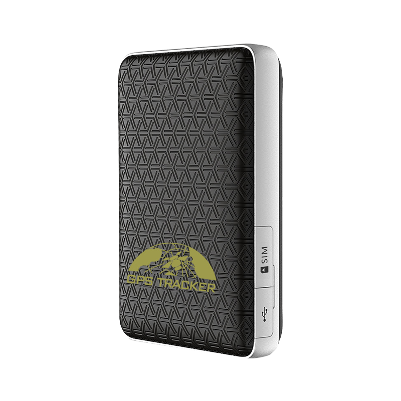

# Coban - BN-501

The BN-501 is a compact, jewelry style GPS tracker designed for discreet wearable safety and concealed asset tracking. It combines satellite positioning with WiFi assisted fixes, BLE 5.0 and multi network cellular communications to provide regular location updates, on device alarms and configurable power modes suited to extended use. The form factor and feature mix make it appropriate where comfort and concealment are priorities.

This model is Plaspy compatible out of the box, which means location and event data from the BN-501 can be integrated into Plaspy for real time monitoring, alerting and reporting. Plaspy can ingest the tracker’s position, proximity and alarm events to provide mapped tracking, dashboard visibility and notification workflows that match personal safety, pet monitoring and unobtrusive asset protection use cases.

## Key Highlights

- Designed as a discreet wearable tracker for personal safety and concealed asset monitoring.
- Plaspy compatible out of the box for straightforward integration into monitoring and alerting workflows.
- Multi network cellular connectivity plus GPS and WiFi assisted positioning for broad coverage and better fixes.
- BLE 5.0 support for on device configuration and proximity based scenarios.
- Configurable power profiles to balance reporting frequency and battery endurance for long term use.
- Built in SOS help alarm and motion related alerts for immediate incident notification.
- Compact strap or jewelry style form factor for comfortable continuous wear and concealment.

## How It Works with Plaspy

When connected to Plaspy, the BN-501 provides continuous position and event telemetry that Plaspy can display, alert on, and include in historical reporting. Plaspy uses those inputs to generate live maps, notifications and operational summaries so teams can monitor devices at scale while preserving the discreet nature of the hardware.

- Real time location and telemetry appear in Plaspy dashboards for live tracking and situational awareness.
- SOS help alarms and other alerts are forwarded to Plaspy to trigger notifications and escalation workflows.
- Movement, shock and geo fence events are logged in Plaspy as actionable events for safety and anti theft responses.
- BLE based configuration supports in field setup and proximity features that Plaspy aware apps can leverage.
- Battery status and low battery alerts feed into Plaspy telemetry for maintenance planning and device health monitoring.

## Typical Use Cases

- Personal safety and elder care monitoring with discreet SOS and motion alerts for caregiver notification.
- Child protection and supervision using a jewelry style tracker that blends into daily wear.
- Pet tracking and collar or accessory attachment for concealed monitoring of companion animals.
- Unobtrusive personnel safety for field staff in roles where visible trackers are impractical.
- Concealed asset monitoring in luggage or personal items where small form factor and alerts matter.

## Why Choose This Tracker with Plaspy

The BN-501 is a practical option for organizations and individuals who need a low profile, wearable tracking device that feeds into a centralized monitoring platform. Its combination of positioning methods, BLE configuration and multiple connectivity options helps Plaspy users maintain visibility and respond to incidents without compromising comfort or concealment.

For anyone evaluating wearable options, the BN-501 pairs naturally with Plaspy’s mapping, alerting and reporting features to deliver a compact tracking solution for personal safety, pet monitoring and discreet asset protection. To learn more about Plaspy and how it can support BN-501 deployments visit https://www.plaspy.com. Product specifications and availability can change over time, so please verify current details with the manufacturer at https://www.coban.net/.
