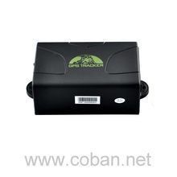

# Coban - GPS104

The Coban GPS104 is a versatile GPS tracker that combines GSM GPRS wireless communication with satellite positioning to provide continuous location and status monitoring for vehicles and assets. It supports multiple tracking modes and timing options, offers a range of alert types, and exposes logged position data for visualization on PCs, mobile devices, or mapping services such as Google Earth.

As a device compatible with Plaspy, the GPS104 can feed its location updates and alarm events into the Plaspy platform so fleets and operations teams gain real time visibility and historical tracking. Plaspy can make use of the GPS104's configurable reporting modes and alarm signals to reduce data traffic while delivering actionable monitoring, alerts, and reporting across a vehicle fleet.

## Key Highlights

- Combines cellular wireless communication with GPS satellite positioning for real time tracking and monitoring.
- Multiple tracking modes including single locate, continuous auto tracking, and scheduled or interval based tracking.
- Smart tracking options that use time and distance intervals to limit unnecessary updates and reduce data usage.
- Variety of alarm and status features such as overspeed, SOS, shock sensor, low battery, power off, and GPS blind spot alerts.
- Data logging and data forward features that allow position history export and third party message forwarding.
- Vehicle state related features like oil and power system control and charge inquiry, plus optional voice surveillance and terminal time settings.
- Flexible communication options with ability to switch between SMS and GPRS modes and support for standard network communication modes.

## How It Works with Plaspy

Plaspy ingests position and event data from compatible devices like the Coban GPS104 and presents that information within dashboards, maps, and reports for fleet managers and dispatchers. Integration focuses on using the device's reporting behaviors and alarm signals to provide efficient, actionable tracking and alerts.

- Map real time locations and recent position history of GPS104 devices in Plaspy for fleet visibility.
- Convert device alarm types into Plaspy notifications and event logs for faster operational response.
- Use scheduled and interval tracking modes from the device to balance update frequency and data usage as reflected in Plaspy reports.
- Aggregate logged positions from the GPS104 for route reconstruction, utilization reporting, and playback within Plaspy.
- Combine device state signals with Plaspy dashboards to monitor vehicle conditions and operational status across a fleet.

## Typical Use Cases

- Fleet vehicle location monitoring for delivery, service, or transportation operations.
- Asset tracking where scheduled or smart interval reporting reduces data consumption.
- Real time alerting for incidents such as SOS, overspeed, shock events, or unexpected power loss.
- Historical route analysis and position playback for dispatch reviews and operational audits.
- Remote status checks and logging for mixed fleets where occasional voice monitoring or charge queries are required.

## Why Choose This Tracker with Plaspy

The Coban GPS104 is a practical choice for organizations that need a balance of configurable tracking behavior and a broad set of alarm and state features. Its ability to operate with scheduled, smart, and continuous tracking modes helps teams control data flow while maintaining frequent enough updates for operational needs. When paired with Plaspy, those device capabilities become visible through maps, alerts, and reports that suit fleet oversight and operational decision making.

Because the GPS104 exposes multiple event types and logging options, Plaspy can use those feeds to build clearer situational awareness across vehicles and assets without excessive data overhead. For teams focused on real time monitoring, incident alerting, and historical analysis, the combination of the GPS104 and Plaspy offers a flexible, practical tracking solution.

To learn more about how Plaspy can work with compatible trackers like the Coban GPS104 visit https://www.plaspy.com. Product specifications and manufacturer services can change over time, so please verify current device details and compatibility on the official Coban website https://www.coban.net/.
