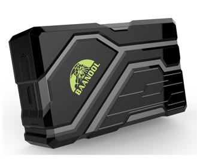

# Coban - GPS108

The Coban GPS108 is a compact and versatile GPS tracker designed for precise location tracking and broad monitoring applications. It uses GPS satellites and the existing GSM GPRS network to report position and status, and it is commonly applied to vehicle theft protection, personal monitoring for children or elderly family members, pet tracking, and personnel oversight. The device provides detailed address level positioning and a suite of configurable alarms and tracking modes that make it useful for many basic tracking needs.

As a Plaspy compatible device, the GPS108 can feed live location and alarm information into Plaspy for centralized visibility and operational control. Plaspy can display tracked positions, historical routes, and event alerts from the GPS108 alongside other devices in a single fleet or asset view, helping teams monitor activity, respond to incidents, and produce reports without managing multiple systems.

## Key Highlights

- Accurate positioning with reported GPS accuracy around 5 meters for street level location.
- Multi mode reporting that relies on GPS and GSM GPRS communications for remote monitoring.
- Practical alarm and tracking features including geo fencing, over speed alerts, movement alarm, and low battery notification.
- Rugged design with IP67 waterproof rating suitable for outdoor and vehicle use.
- Long standby and schedule mode endurance supported by a high capacity internal battery for extended deployments.
- Quick satellite acquisition times that help deliver timely location fixes for rapid tracking.

## How It Works with Plaspy

The GPS108 can be configured to send location updates and alarm events to Plaspy so that fleet managers and operators can view positions, set geo fences, and receive notifications through the Plaspy platform. Integration provides a single pane of glass for tracking devices alongside other fleet data.

- Centralize GPS108 location updates within Plaspy for live map visualization and historical route playback.
- Use Plaspy to receive and act on GPS108 alerts such as geo fence breaches, movement or shock events, and low battery warnings.
- Leverage Plaspy reporting to analyze device activity, trip summaries, and event frequency for operational insights.
- Combine GPS108 data with other devices in Plaspy for fleet level monitoring and consolidated oversight.
- Configure notification rules in Plaspy to route GPS108 alarms to appropriate teams for faster response.

## Typical Use Cases

- Vehicle theft deterrence and recovery monitoring for cars, vans, and light trucks.
- Location and welfare monitoring for children, elderly persons, or vulnerable individuals.
- Asset tracking for movable equipment or valuable items that require occasional or continuous oversight.
- Personnel tracking for remote workers where location visibility and safety alerts are required.
- Pet tracking where waterproofing and compact form factor are beneficial.

## Why Choose This Tracker with Plaspy

The Coban GPS108 pairs practical tracking features with long endurance and robust enclosure ratings, making it a sensible option for organizations that need reliable position updates and a range of alarm functions. When paired with Plaspy, the GPS108 becomes part of a larger monitoring and reporting environment that helps teams standardize how they receive location data and manage incidents across fleets and assets.

Because the GPS108 supports address level positioning and common alarm types, it fits well into workflows that prioritize location accuracy, event visibility, and long term deployments. Plaspy complements the device by providing mapping, alerting, and reporting tools so teams can turn raw location data into operational decisions.

To learn more about Plaspy and how it can manage Coban GPS108 trackers, visit https://www.plaspy.com. Product specifications and availability can change over time, so please verify current technical details and support information on the manufacturer site https://www.coban.net/.
