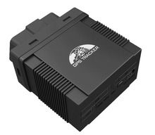

# Coban - GPS306

The Coban GPS306 is a versatile GPS tracker that allows you to locate and monitor remote targets using the existing GSM/GPRS network and GPS satellites. With support for multiple frequency bands \(850/900/1800/1900Mhz\), this tracker can be used worldwide. Whether you need to track a vehicle, a person, or any other valuable asset, the GPS306 has you covered.

One of the standout features of the GPS306 is its ability to provide real-time location updates via SMS or internet. You can easily track the device's location using your smartphone or computer, making it ideal for fleet management, personal tracking, or even keeping an eye on your loved ones. Additionally, the GPS306 offers a range of advanced features such as geo-fencing, over-speed alarm, movement alarm, and more, allowing you to customize the tracker to suit your specific needs.

With its compact design and easy installation, the Coban GPS306 is a reliable and user-friendly GPS tracker that offers peace of mind and security. Whether you're a business owner looking to improve fleet efficiency or a concerned parent wanting to keep your family safe, the GPS306 is the perfect solution.

### Key Features:

- Real-time location tracking via SMS or internet
- Supports multiple frequency bands \(850/900/1800/1900Mhz\)
- Geo-fencing and over-speed alarm
- Movement alarm and low battery alarm
- Compact design and easy installation

