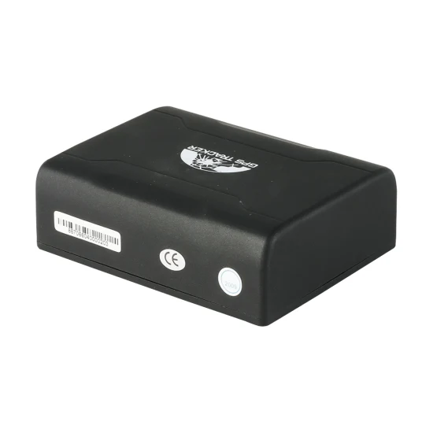

# Coban - GPS-109

The Coban GPS-109 is a compact and portable GPS tracker designed to locate and monitor remote targets using GPS satellites and the GSM GPRS network. It offers accurate positioning with a listed GPS accuracy of approximately 5 meters and high GPS sensitivity. The device is small and lightweight, with practical mobility features and environmental protection including an IP67 rating, making it suitable for a range of outdoor and mobile tracking scenarios.

As a Plaspy compatible device, the GPS-109 can feed location updates and alarm events into the Plaspy platform for centralized visibility and operational oversight. Plaspy can make use of the GPS-109 reporting capabilities to display locations on maps, trigger alerts for geofence or overspeed events, and include the device in fleet level monitoring and reporting workflows, helping teams turn raw tracker data into actionable information.

## Key Highlights

- Compact and lightweight form factor suitable for covert or portable deployment
- GPS positioning with approximately 5 meter accuracy for street level location
- High sensitivity for reliable satellite reception in varied environments
- IP67 rated housing for protection against dust and temporary water immersion
- Long capacity rechargeable battery for extended field operation
- Supports multiple user access methods including SMS and computer based querying
- Built in functions such as geofence, overspeed and low battery alerts

## How It Works with Plaspy

Plaspy receives the GPS-109 location and status updates and presents them in a unified interface for monitoring, alerting, and reporting. Integration lets organizations combine GPS-109 data with other devices and operational data inside Plaspy to improve situational awareness and decision making.

- Live location display on Plaspy maps for real time visibility of tracked units
- Geofence monitoring and alerts based on GPS-109 fence events
- Alerts for movement, overspeed conditions, and low battery forwarded into Plaspy’s notification system
- Historical route playback and location history for post event analysis and reporting
- Grouping and fleet management to view multiple GPS-109 devices together for operational oversight

## Typical Use Cases

- Vehicle fleet tracking for small to medium sized fleets requiring portable trackers
- Asset protection and recovery for valuable or movable equipment
- Short term rentals and temporary deployments where portability matters
- Remote personnel location monitoring for safety and logistics
- Shipment and cargo tracking when discrete, weather resistant devices are needed

## Why Choose This Tracker with Plaspy

The GPS-109 combines compact dimensions, durable construction, and accurate positioning, making it a practical choice for organizations that need flexible placement and reliable location data. When paired with Plaspy, the device’s reporting and alarm features become part of a larger operational view, enabling managers to monitor assets, respond to alerts, and review historical movement from a single platform.

While technical specifications such as sensitivity, start times, and battery capacity give a sense of expected performance, Plaspy focuses on extracting useful insights from the GPS-109 data stream rather than changing device behavior. This makes the GPS-109 a good fit for teams that want a straightforward tracker that integrates into a comprehensive fleet and asset management workflow.

To learn more about how Plaspy works with compatible trackers visit https://www.plaspy.com. Product specifications and availability can change over time so please verify current details and official documentation on the manufacturer site https://www.coban.net/.
