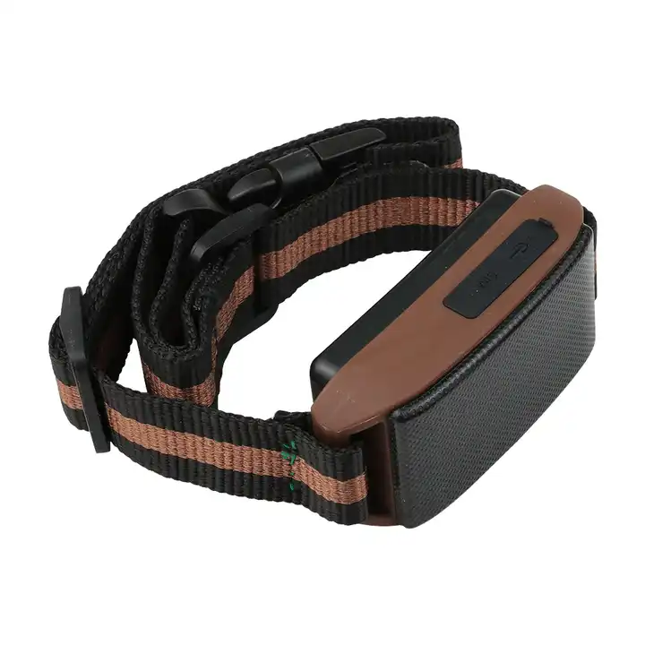

# Coban - GPS-201

The Coban GPS-201 is a compact pet GPS tracker designed for pet positioning, tracking, training, and socialization. It combines dedicated hardware with an integrated pet management app to help owners monitor location, interact remotely, and support training and social behavior. The device is rated IP67 for weather protection and offers extended standby time to suit continuous monitoring needs.

As a device compatible with Plaspy, the GPS-201 can be integrated into Plaspy for consolidated visibility and management alongside other tracked assets. Plaspy can display the tracker location, status, and historical movement in a single fleet or device view, making the GPS-201 relevant for owners, trainers, and pet service providers who want centralized oversight and reporting.

## Key Highlights

- Purpose built for pet positioning, tracking, and remote interaction
- Integrated app oriented features for training, calling home, and socialization
- Long standby operation that supports extended monitoring sessions
- Weather resistant design with IP67 durability for outdoor use
- Practical tracking accuracy suitable for daily pet monitoring and recovery
- Recognized safety and quality certifications including CE and FCC

## How It Works with Plaspy

The GPS-201 can feed location and status information into Plaspy so pets and devices are visible on a unified platform. Plaspy provides map visualization, history, and device management tools that make it straightforward to monitor multiple trackers from one place.

- Real time location display on Plaspy maps for live tracking of pets
- Historical route playback to review past movements and activity
- Alerts and notifications for events configured in Plaspy such as leaving predefined areas or changes in device status
- Device grouping and tagging to organize multiple pets or client devices
- Reporting features for summaries of location history and operational oversight

## Typical Use Cases

- Home pet owners monitoring daily location and outdoor activity
- Professional trainers using remote interaction and tracking to support behavior programs
- Pet sitters and boarding facilities overseeing multiple animals in one interface
- Rescue groups and shelters tracking animals during outings or transfers
- Walkers and pet services providing client reporting and location transparency

## Why Choose This Tracker with Plaspy

The Coban GPS-201 is a practical choice for organizations and individuals who need a dedicated pet tracker that pairs with a broader monitoring platform. Its focus on pet management features and robust physical protection make it appropriate for routine pet care, training scenarios, and services that benefit from centralized visibility.

Pairing the GPS-201 with Plaspy brings the device into a familiar operational view alongside other tracked assets, easing multi device management and reporting. That combination is useful when managing many animals or when service providers need consistent tracking and historical data for operations and client communication.

To learn more about how Plaspy can manage compatible trackers like the Coban GPS-201 visit https://www.plaspy.com. Product specifications and availability can change over time, so verify current details and technical information on the manufacturer site https://www.coban.net/.
