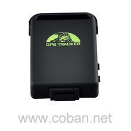

# Coban - TK102

The Coban TK102 is a compact and versatile GPS tracker designed for a range of tracking needs. According to the manufacturer description, it uses GPS satellites together with existing GSM GPRS network services to determine and report location, and it supports tracking via SMS as well as computer or PDA based monitoring. The unit includes a broad set of features commonly used for asset and personal protection such as geo fencing, movement and overspeed alerts, SOS alarm, monitoring, and data logging.

As a Plaspy compatible device, the TK102 can be integrated into Plaspy to centralize location streams and alerts in a single platform. That compatibility allows organizations to combine the TK102 device data with Plaspy maps, monitoring interfaces, and reporting tools to improve visibility and operational oversight without changing the tracker hardware already in use.

## Key Highlights

- Versatile tracking suitable for vehicles and personal safety applications
- Uses GPS satellite positioning with GSM GPRS network reporting for remote location updates
- Multiple alert types including geo fence, overspeed, movement, and SOS notifications
- Built in data logging and monitoring functions for historical review
- Configurable behaviour options such as sleep modes and automatic tracking intervals
- Options for tracking via SMS or computer based monitoring depending on deployment

## How It Works with Plaspy

Plaspy can ingest and display location and alert information from TK102 devices so teams can view positions, review history, and act on events from a unified dashboard. Integration focuses on using the tracker as a source of position and alarm data that Plaspy processes for visibility and reporting.

- Real time location display on Plaspy maps for single units or grouped assets
- Historical route playback and stored position review using the TK102 data logs
- Alert handling inside Plaspy for geo fence breaches, SOS triggers, movement and overspeed events
- Centralized monitoring for mixed fleets combining TK102 devices with other compatible trackers
- Reports and exportable logs to analyze trips and incidents over selected time ranges

## Typical Use Cases

- Vehicle theft protection and recovery monitoring for cars or motorcycles
- Monitoring of vulnerable people such as children or elderly family members
- Simple fleet oversight for small businesses managing delivery or service vehicles
- Personnel tracking for mobile workers where discrete location monitoring is required
- Temporary asset tracking when equipment is loaned or moved between sites

## Why Choose This Tracker with Plaspy

The TK102 is a practical option when you need a proven, straightforward GPS tracker that supports common tracking and alarm features. Its range of built in alerts and logging capabilities make it suitable for organizations that want to add devices to Plaspy without replacing existing hardware. Using Plaspy to consolidate TK102 feeds adds centralized visibility, easier alert management, and consistent reporting across devices.

Because the TK102 is broadly used and supports multiple reporting methods, it can be a cost effective choice for teams that need basic to intermediate tracking functionality combined with Plaspy platform tools. If your requirements rely on advanced telemetry beyond location and alarms, review available features carefully as implementations and firmware options can vary by unit.

To learn more about Plaspy and how the platform can work with devices like the Coban TK102 visit https://www.plaspy.com. Product specifications, availability, and manufacturer details can change over time, so please verify current technical information and configuration options on the official Coban site https://www.coban.net/.
